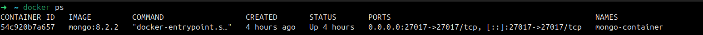
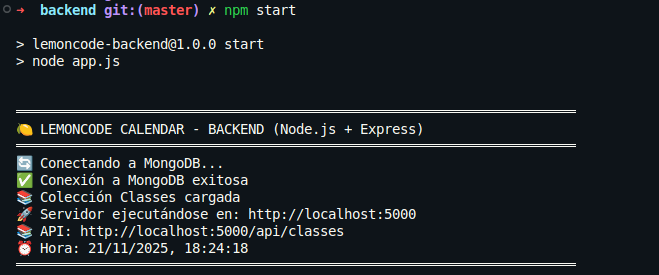
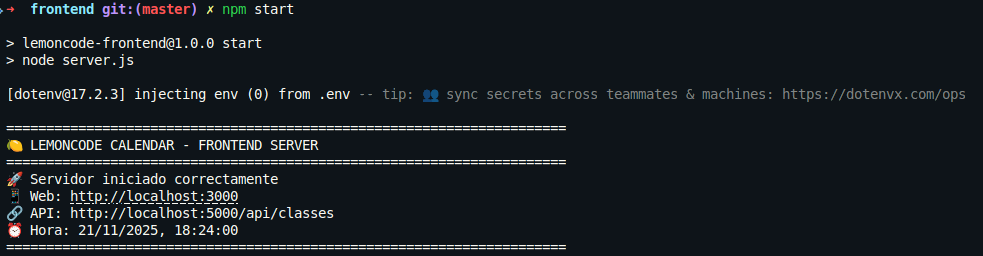
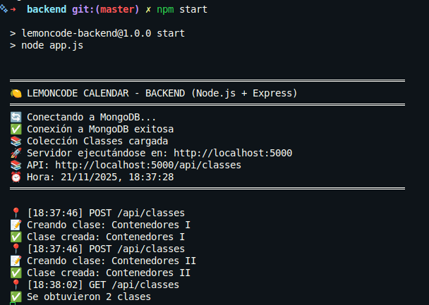
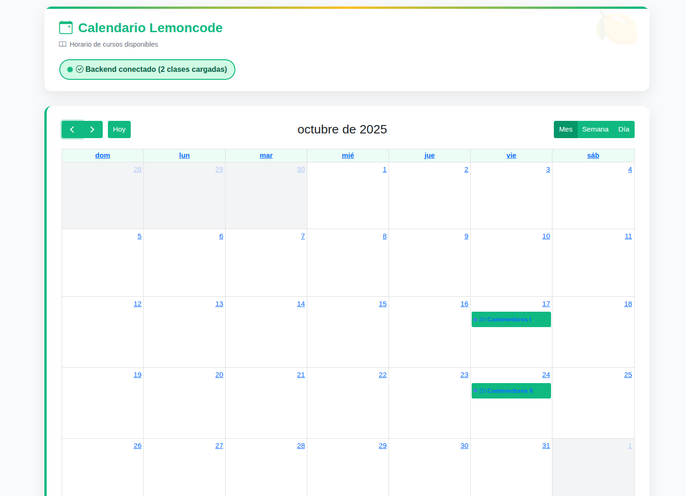
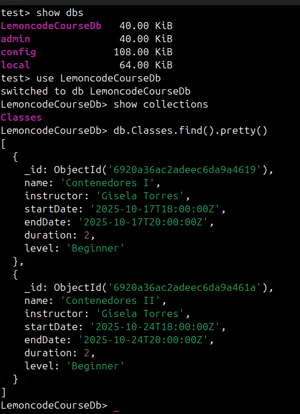

# Reto 1: MongoDB en Contenedor

## Crear una red Docker para la comunicación

```bash
docker network create lemoncode-network
```

<br>

## Ejecutar MongoDB en un contenedor con persistencia de datos

Creamos un volumen para persistir los datos de MongoDB:

```bash
docker volume create mongo-data
```

Ejecutamos el contenedor de MongoDB con las siguientes características:

- Conectado a la red creada.
- Con el volumen para persistencia.
- Mapeando el puerto 27017 del host al contenedor.
- Usando la imagen oficial de MongoDB con una versión fija para evitar usar latest.

```bash
docker run -d \
  --name mongo-container \
  --network lemoncode-network \
  -p 27017:27017 \
  -v mongo-data:/data/db \
  mongo:8.2.2
```

<br>

## Modificar la configuración del backend

Editamos el fichero .env.template cambiandole el nombre a .env y actualizamos las variables de entorno para que apunten a nuestro contenedor de MongoDB:

```yaml
DATABASE_URL=mongodb://localhost:27017
DATABASE_NAME=LemoncodeCourseDb
HOST=localhost
PORT=5000
```

<br>

## Verificar que todo funciona correctamente

### Comprobamos que el contenedor de MongoDB está corriendo correctamente:



---

### Arrancamos el backend:

```bash
npm start
```



---

### Arrancamos el frontend:

```bashbash
npm start
```



---

### Probamos de insertar datos:

```bash
curl -d '{"name":"Contenedores I","instructor":"Gisela Torres","startDate":"2025-10-17T18:00:00Z","endDate":"2025-10-17T20:00:00Z","duration":2,"level":"Beginner"}' -H "Content-Type: application/json" -X POST http://localhost:5000/api/classes

curl -d '{"name":"Contenedores II","instructor":"Gisela Torres","startDate":"2025-10-24T18:00:00Z","endDate":"2025-10-24T20:00:00Z","duration":2,"level":"Beginner"}' -H "Content-Type: application/json" -X POST http://localhost:5000/api/classes
```

---

### Comprobamos que los datos se han insertado correctamente desde el frontend:





---

### Verificamos los datos en MongoDB:

```bash
docker exec -it mongo-container mongo
```

