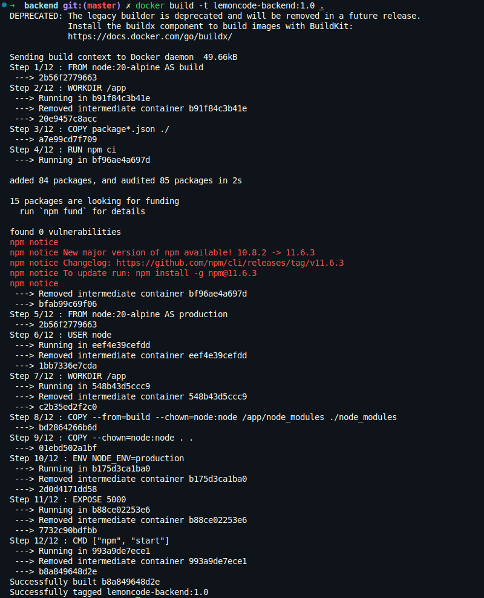
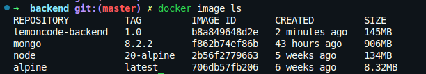
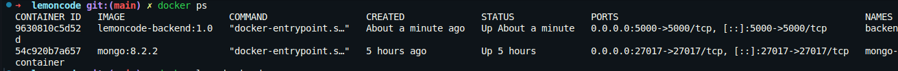
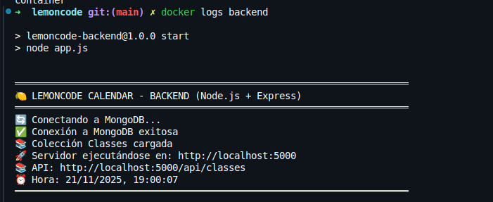
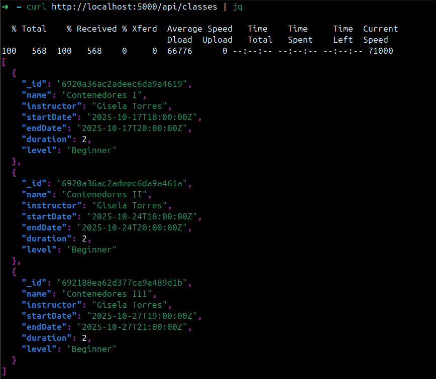

# Reto 2: Dockerizar el Backend

## Crear un dockerignore para el backend:

Creamos un fichero .dockerignore en la raíz del proyecto backend para evitar copiar archivos innecesarios a la imagen Docker:

```yaml
# Node
node_modules

# Git
.git
.gitignore

# Docker
Dockerfile
.dockerignore
.devcontainer

# Documentación
README.md

# Cliente HTTP de pruebas
client.http
```

## Crear un Dockerfile para el backend:

```dockerfile
#### Stage 1: Build
FROM node:20-alpine AS build

WORKDIR /app

COPY package*.json ./

RUN npm ci

#### Stage 2: Production
FROM node:20-alpine AS production

USER node

WORKDIR /app

COPY --from=build --chown=node:node /app/node_modules ./node_modules
COPY --chown=node:node . .

ENV NODE_ENV=production

EXPOSE 5000

CMD ["npm", "start"]
```

## Comprobamos que la imagen se ha creado correctamente:

 



## Ejecutar el contenedor del backend:

```bash
docker run -d \
  --name backend \
  --network lemoncode-network \
  -p 5000:5000 \
  -e HOST=0.0.0.0 \
  -e PORT=5000 \
  -e DATABASE_URL=mongodb://mongo-container:27017 \
  -e DATABASE_NAME=LemoncodeCourseDb \
  lemoncode-backend:1.0
```

## Verificar que el contenedor del backend está corriendo correctamente:



## Verificar que el backend se conecta correctamente a MongoDB con los logs del contenedor:



## Probar la API del backend (No uso client.http porque no quiero cargar todos los datos de golpe, en el último reto lo haremos):

```bash
curl -d '{"name":"Contenedores III","instructor":"Gisela Torres","startDate":"2025-10-27T19:00:00Z","endDate":"2025-10-27T21:00:00Z","duration":2,"level":"Beginner"}' -H "Content-Type: application/json" -X POST http://localhost:5000/api/classes
```

