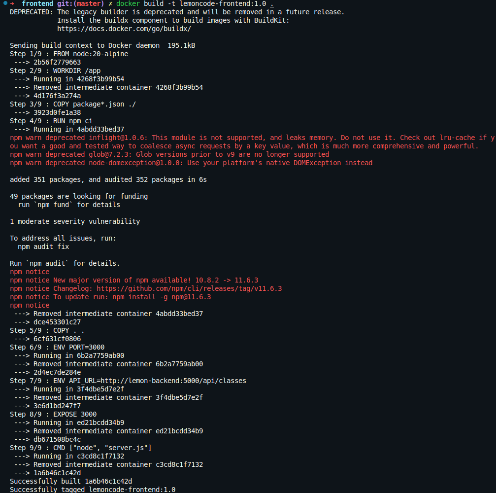
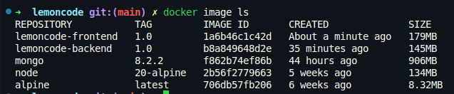
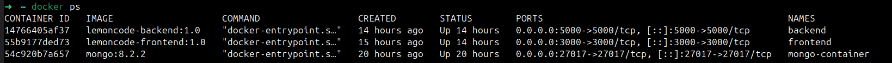
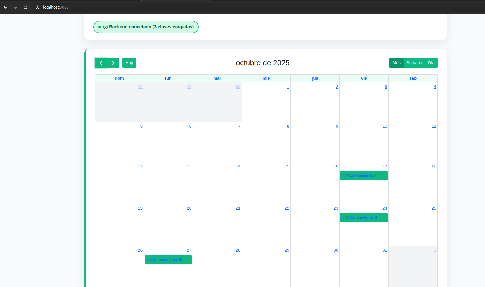
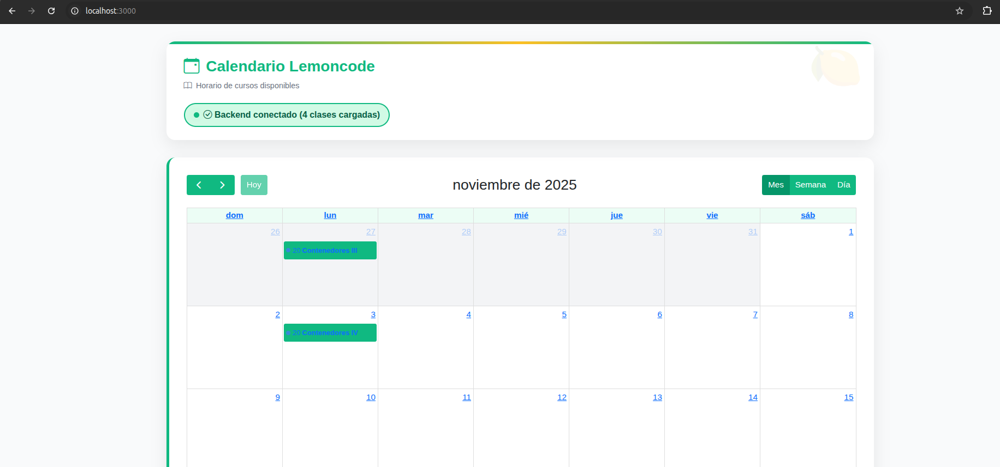

# Reto 3: Dockerizar el Frontend

## Crear un dockerignore para el frontend:

Creamos un fichero .dockerignore en la raíz del proyecto frontend para evitar copiar archivos innecesarios a la imagen Docker:

```yaml
# Node
node_modules

# Git
.git
.gitignore

# Docker
Dockerfile
.dockerignore
```

## Crear un Dockerfile para el frontend:

```dockerfile
FROM node:20-alpine

WORKDIR /app

COPY package*.json ./
RUN npm ci

COPY . .

ENV PORT=3000

EXPOSE 3000

CMD ["node", "server.js"]
```

## Comprobamos que la imagen se ha creado correctamente:





## Ejecutamos el contenedor del frontend:

```bash
docker run -d \                       
  --name frontend \
  --network lemoncode-network \
  -p 3000:3000 \
  -e API_URL=http://backend:5000/api/classes \
  lemoncode-frontend:1.0
```

## Verificamos que el contenedor del frontend está corriendo correctamente (pone hace 14 horas porque voy hago la documentación al día siguiente):



## Probamos de acceder al frontend desde el navegador:



## Probamos a crear una nueva clase desde la api y verificar que se refleja en el frontend (No uso client.http porque no quiero cargar todos los datos de golpe, en el último reto lo haremos):

```bash
curl -d '{"name":"Contenedores IV","instructor":"Gisela Torres","startDate":"2025-11-03T19:00:00Z","endDate":"2025-11-03T21:00:00Z","duration":2,"level":"Beginner"}' -H "Content-Type: application/json" -X POST http://localhost:5000/api/classes
```


