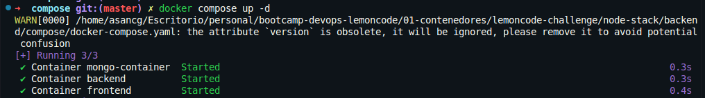
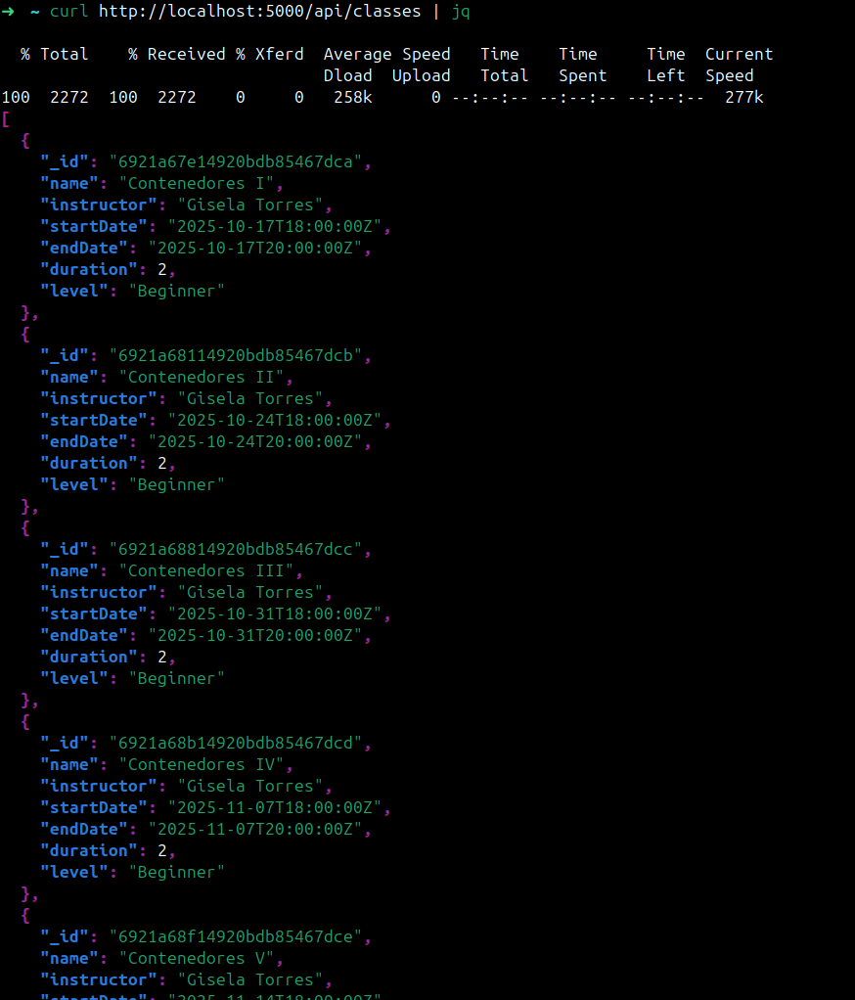
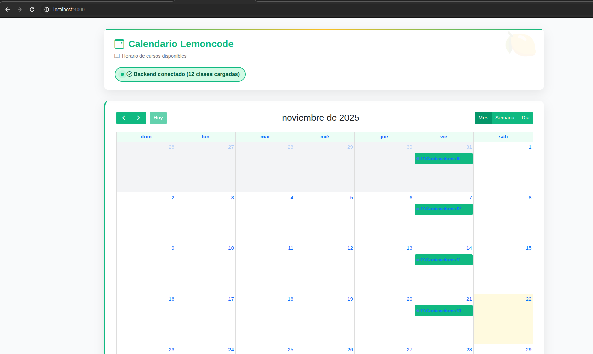

# Reto 4: Docker Compose - Todo Junto

## Crear un fichero .env

```ini
# --- FRONTEND ---
API_URL=http://backend:5000/api/classes

# --- BACKEND ---
HOST=0.0.0.0
PORT=5000
DATABASE_URL=mongodb://mongo-container:27017
DATABASE_NAME=LemoncodeCourseDb

# --- MONGO ---
MONGO_PORT=27017
BACKEND_PORT=5000
FRONTEND_PORT=3000
```

## Crear un fichero docker-compose.yml

```yaml
version: "3.9"

# Definición de todos los servicios que componen la aplicación
services:

  # SERVICIO: MONGODB
  mongo:
    # Imagen oficial de MongoDB
    image: mongo:8.2.2
    # Nombre del contenedor
    container_name: mongo-container
    # Mapeo de puertos: puerto del host → puerto del contenedor
    # ${MONGO_PORT} se obtiene del archivo .env (27017)
    ports:
      - "${MONGO_PORT}:27017"
    # Volúmen persistente
    volumes:
      - mongo-data:/data/db
    # Red personalizada para comunicación entre contenedores (explicada más abajo)
    networks:
      - lemoncode-network

  # SERVICIO: BACKEND
  backend:
    # Aprovechamos la imagen construida en el ejercicio 2
    image: lemoncode-backend:1.0
    container_name: backend
    # Este servicio espera a que MongoDB esté listo antes de iniciarse
    depends_on:
      - mongo
    # Variables de entorno recogidas del archivo .env
    environment:
      HOST: ${HOST}
      PORT: ${PORT}
      DATABASE_URL: ${DATABASE_URL}
      DATABASE_NAME: ${DATABASE_NAME}
    # Mapeo de puertos: 3000→5000
    ports:
      - "${BACKEND_PORT}:5000"
    networks:
      - lemoncode-network

  # SERVICIO: FRONTEND
  frontend:
    # Aprovechamos la imagen construida en el ejercicio 3
    image: lemoncode-frontend:1.0
    container_name: frontend
    # Este servicio espera a que el backend esté listo antes de iniciarse
    depends_on:
      - backend
    # Variables de entorno recogidas del archivo .env
    environment:
      API_URL: ${API_URL}
    # Mapeo de puertos: 3000→3000
    ports:
      - "${FRONTEND_PORT}:3000"
    networks:
      - lemoncode-network

# CONFIGURACIÓN DE REDES
# Define una red personalizada para que los contenedores se comuniquen
networks:
  # Nombre de la red
  lemoncode-network:
    # Driver de red: bridge permite que contenedores se comuniquen por nombre
    driver: bridge

# CONFIGURACIÓN DE VOLÚMENES
# Define volúmenes nombrados para persistencia de datos
volumes:
  # Volumen para almacenar datos de MongoDB de forma permanente
  # Persiste incluso si el contenedor se elimina
  mongo-data:
```

## Ejecutar Docker Compose



## Verificar que los contenedores están corriendo


## Ejecutamos todo lo que hay en el fichero client.http para rellenar la base de datos



## Verificar que la aplicación funciona desde el navegador

