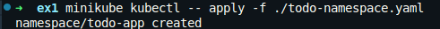
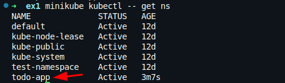
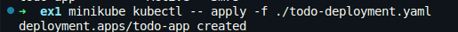
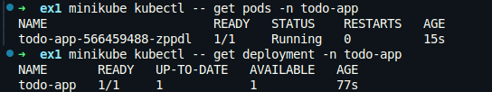
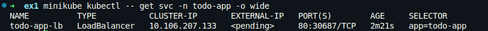

# Ejercicio 1

Para no ensuciar default, creamos un namespace llamado todo-app.

```yaml
# todo-namespace.yaml
apiVersion: v1
kind: Namespace
metadata:
  name: todo-app
```

Dentro de este namespace, creamos un deployment de solo una réplica ya que este ejercicio no tiene base de datos. Si creamos más réplicas, cada una tendrá su propia lista de tareas y no estarán sincronizadas entre sí.

```yaml
# todo-deployment.yaml
apiVersion: apps/v1
kind: Deployment
metadata:
  name: todo-app
spec:
  replicas: 1
  selector:
    matchLabels:
      app: todo-app
  template:
    metadata:
      labels:
        app: todo-app
    spec:
      containers:
        - name: todo-app
          image: lemoncodersbc/lc-todo-monolith:v5-2024
          ports:
            - containerPort: 3000
          env:
            - name: NODE_ENV
              value: "production"
            - name: PORT
              value: "3000"
```

Finalmente, exponemos el deployment mediante un servicio de tipo LoadBalancer.

```yaml
# todo-loadbalancer.yaml
apiVersion: v1
kind: Service
metadata:
  name: todo-app-lb
  namespace: todo-app
spec:
  type: LoadBalancer
  selector:
    app: todo-app
  ports:
    - port: 80
      targetPort: 3000
```

Ejecutamos el namespace.



Comprobamos que se ha creado correctamente.



Ejecutamos el deployment.



Comprobamos que se ha creado correctamente.



Ejecutamos el servicio LoadBalancer.


Comprobamos que se ha creado correctamente. Podemos observar que no tiene external IP todavía. Esto es normal, ya que minikube no dispone de un balanceador real, por lo que el campo EXTERNAL-IP aparece como pending aunque el servicio esté correctamente creado.  



Para acceder a un LoadBalancer en Minikube se utiliza el comando:

```bash
minikube service todo-app-lb -n todo-app
```


Al ejecutar este comando, Minikube abre una nueva pestaña en el navegador con la URL correcta para acceder al servicio LoadBalancer.

Ahora ya podemos ver la aplicación de lista de tareas funcionando.

