# Ejercicio 2

## PASO 1: Creamos un namespace llamado `todo-app`

```yaml
# todo2-namespace.yaml
apiVersion: v1
kind: Namespace
metadata:
  name: todo-app
```
Ejecutamos el siguiente comando para crear el namespace:

```bash
kubectl apply -f todo2-namespace.yaml
```

Comprobamos que se ha creado correctamente:

```bash
kubectl get ns
```
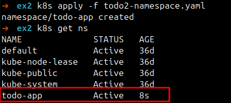

## PASO 2: Creamos storageclass

```yaml
# todo2-storageclass.yaml
apiVersion: storage.k8s.io/v1
kind: StorageClass
metadata:
  name: todo-app-sc
provisioner: kubernetes.io/no-provisioner
volumeBindingMode: WaitForFirstConsumer
```

Ejecutamos el siguiente comando para crear el storageclass:

```bash
kubectl apply -f todo2-storageclass.yaml
```

Comprobamos que se ha creado correctamente:

```bash
kubectl get sc
```

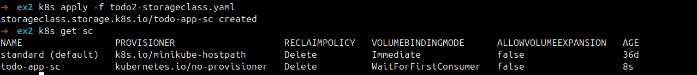

## PASO 3: Creamos un PersistentVolume

```yaml
# todo2-pv.yaml
apiVersion: v1
kind: PersistentVolume
metadata:
  name: postgres-pv
spec:
  capacity:
    storage: 1Gi
  accessModes:
    - ReadWriteOnce
  storageClassName: todo-app-sc
  persistentVolumeReclaimPolicy: Retain
  hostPath:
    path: /data/todo-app-postgres
    type: DirectoryOrCreate
```

Ejecutamos el siguiente comando para crear el PersistentVolume:

```bash
kubectl apply -f todo2-pv.yaml
```
Comprobamos que se ha creado correctamente:

```bash
kubectl get pv
```

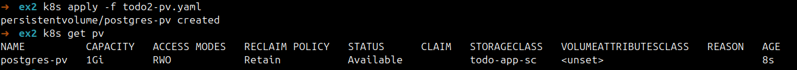

## PASO 4: Creamos un PersistentVolumeClaim

```yaml
# todo2-pvc.yaml
apiVersion: v1
kind: PersistentVolumeClaim
metadata:
  name: postgres-pvc
  namespace: todo-app
spec:
  accessModes:
    - ReadWriteOnce
  storageClassName: todo-app-sc
  resources:
    requests:
      storage: 1Gi
```

Ejecutamos el siguiente comando para crear el PersistentVolumeClaim:

```bash
kubectl apply -f todo2-pvc.yaml
```

Comprobamos que se ha creado correctamente:

```bash
kubectl get pvc -n todo-app
```

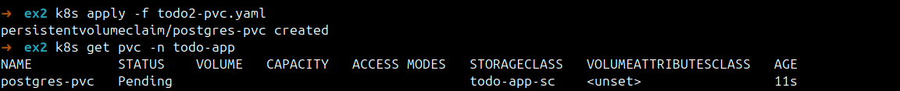

Sale pending porque en el storageclass hemos puesto `volumeBindingMode: WaitForFirstConsumer`, por lo que el PV se vincula al PVC cuando se crea el Pod que lo va a consumir.

## PASO 5: Creamos el configmap para la configuración de la base de datos

Yo lo haría con secrets, pero en el enunciado se pide configmap.

```yaml
# todo2-configmap-pgsql.yaml
apiVersion: v1
kind: ConfigMap
metadata:
  name: postgres-config
  namespace: todo-app
data:
  POSTGRES_USER: postgres
  POSTGRES_PASSWORD: postgres
  POSTGRES_DB: todos_db
```
Ejecutamos el siguiente comando para crear el configmap:

```bash
kubectl apply -f todo2-configmap-pgsql.yaml
```

Comprobamos que se ha creado correctamente:

```bash
kubectl get configmap -n todo-app
```

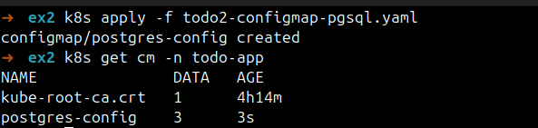

## PASO 6: Creamos el servicio de tipo cluster ip para PostgreSQL

```yaml
# todo2-service-pgsql.yaml
apiVersion: v1
kind: Service
metadata:
  name: postgres
  namespace: todo-app
spec:
  type: ClusterIP
  selector:
    app: postgres
  ports:
    - name: postgres
      port: 5432
      targetPort: 5432
```

Ejecutamos el siguiente comando para crear el servicio:

```bash
kubectl apply -f todo2-service-pgsql.yaml
```

Comprobamos que se ha creado correctamente:

```bash
kubectl get svc -n todo-app
```

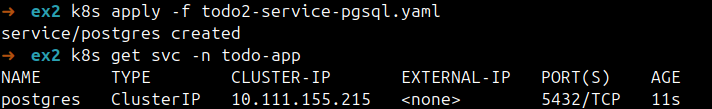

## PASO 7: Creamos el statefulset de PostgreSQL

```yaml
# todo2-statefulset-pgsql.yaml
apiVersion: apps/v1
kind: StatefulSet
metadata:
  name: postgres
  namespace: todo-app
spec:
  serviceName: postgres
  replicas: 1
  selector:
    matchLabels:
      app: postgres
  template:
    metadata:
      labels:
        app: postgres
    spec:
      containers:
        - name: postgres
          image: lemoncodersbc/lc-todo-monolith-psql:v5-2024
          ports:
            - name: postgres
              containerPort: 5432
          envFrom:
            - configMapRef:
                name: postgres-config
          volumeMounts:
            - name: postgres-data
              mountPath: /var/lib/postgresql/data
          readinessProbe:
            tcpSocket:
              port: postgres
            initialDelaySeconds: 10
            periodSeconds: 5
      volumes:
        - name: postgres-data
          persistentVolumeClaim:
            claimName: postgres-pvc
```

Ejecutamos el siguiente comando para crear el statefulset:

```bash
kubectl apply -f todo2-statefulset-pgsql.yaml
```

Comprobamos que se ha creado correctamente:

```bash
kubectl get statefulset -n todo-app
```

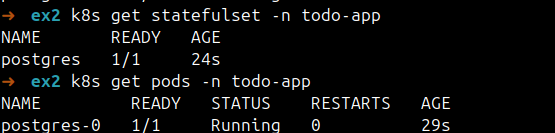

## PASO 8: Comprobamos que el pvc y el pv se han vinculado

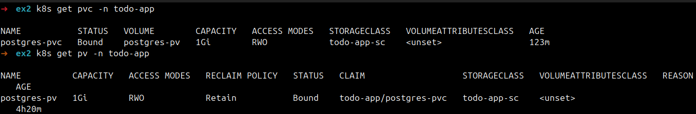

## PASO 9: Comprobamos que la base de datos está funcionando correctamente

Cargamos el seed:

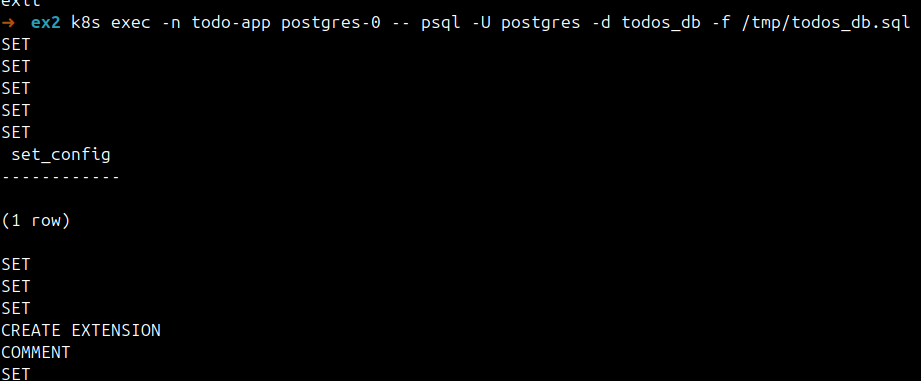   

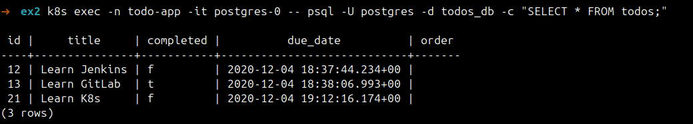

## PASO 10: Creamos un configmap para la configuración de la aplicación

Yo lo haría con secrets, pero en el enunciado se pide configmap.

```yaml
# todo2-configmap-app.yaml
apiVersion: v1
kind: ConfigMap
metadata:
  name: todo-app-config
  namespace: todo-app
data:
  NODE_ENV: "develop"
  PORT: "3000"
  DB_HOST: "postgres"
  DB_USER: "postgres"
  DB_PASSWORD: "postgres"
  DB_PORT: "5432"
  DB_NAME: "todos_db"
  DB_VERSION: "10.4"
```

Ejecutamos el siguiente comando para crear el configmap:

```bash
kubectl apply -f todo2-configmap-app.yaml
```

Comprobamos que se ha creado correctamente:

```bash
kubectl get configmap -n todo-app
```

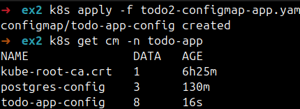

## PASO 11: Creamos el deployment de la aplicación

```yaml
# todo2-deployment-app.yaml
apiVersion: apps/v1
kind: Deployment
metadata:
  name: todo-app
  namespace: todo-app
spec:
  replicas: 1
  selector:
    matchLabels:
      app: todo-app
  template:
    metadata:
      labels:
        app: todo-app
    spec:
      containers:
        - name: todo-app
          image: lemoncodersbc/lc-todo-monolith-db:v5-2024
          ports:
            - name: http
              containerPort: 3000
          envFrom:
            - configMapRef:
                name: todo-app-config
          readinessProbe:
            tcpSocket:
              port: http
            initialDelaySeconds: 10
            periodSeconds: 5
```

Ejecutamos el siguiente comando para crear el deployment:

```bash
kubectl apply -f todo2-deployment-app.yaml
```

Comprobamos que se ha creado correctamente:

```bash
kubectl get deployment -n todo-app
```

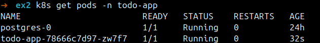

## PASO 12: Creamos el servicio de tipo LoadBalancer para la aplicación

```yaml
# todo2-loadbalancer.yaml
apiVersion: v1
kind: Service
metadata:
  name: todo-app-lb
  namespace: todo-app
spec:
  type: LoadBalancer
  selector:
    app: todo-app
  ports:
    - name: http
      port: 80
      targetPort: 3000
```

Ejecutamos el siguiente comando para crear el servicio:

```bash
kubectl apply -f todo2-loadbalancer.yaml
```

Comprobamos que se ha creado correctamente:

```bash
kubectl get svc -n todo-app
```

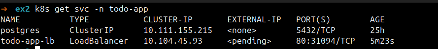

## PASO 13: Simular loadbalancer en minikube

```bash
minikube service todo-app-lb -n todo-app
```


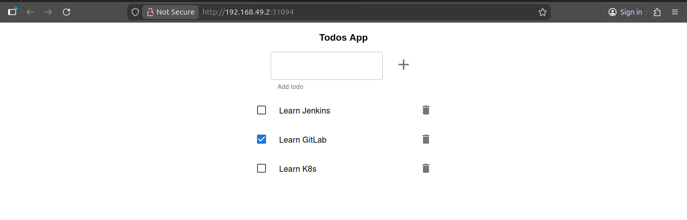

## Get all todo-app resources

```bash
kubectl get all -n todo-app
```

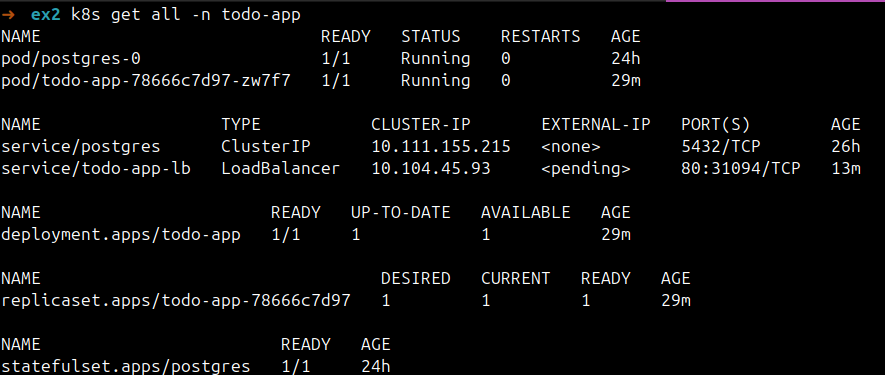

## Prueba de persistencia

Creamos un nuevo todo:

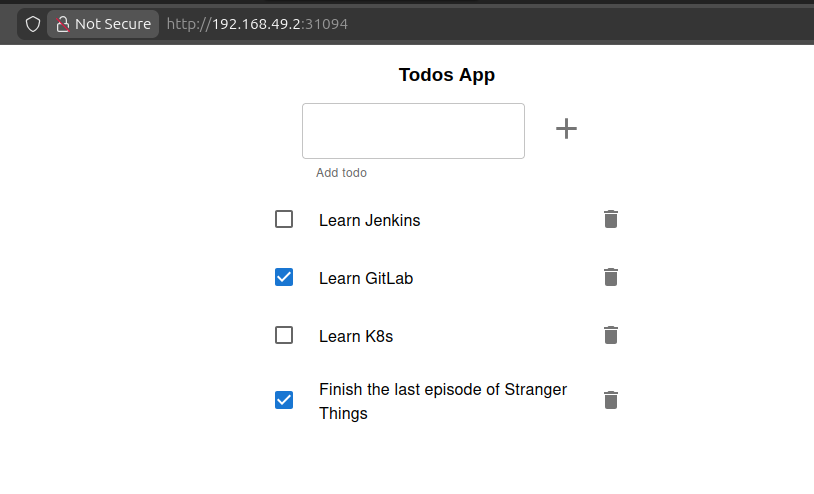

Eliminamos el pod de postgres para simular una caída:

```bash
kubectl delete pod -n todo-app postgres-0
```

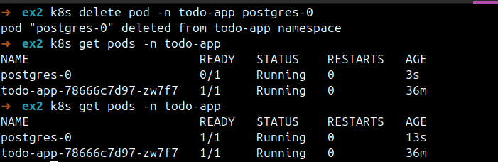

Hacemos captura con el inspector del navegador abierto para ver la petición que se hace al backend (antes y después de refrescar la página):

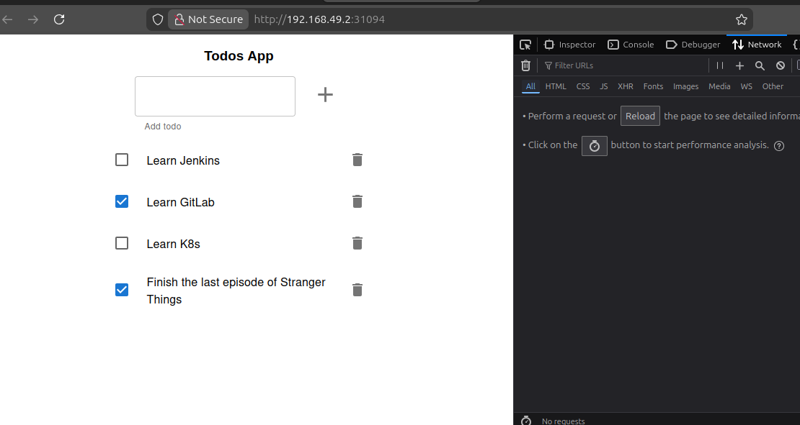

Podemos ver que el todo que habíamos creado antes de eliminar el pod sigue ahí después de que el pod se haya reiniciado y hayamos refrescado la página:

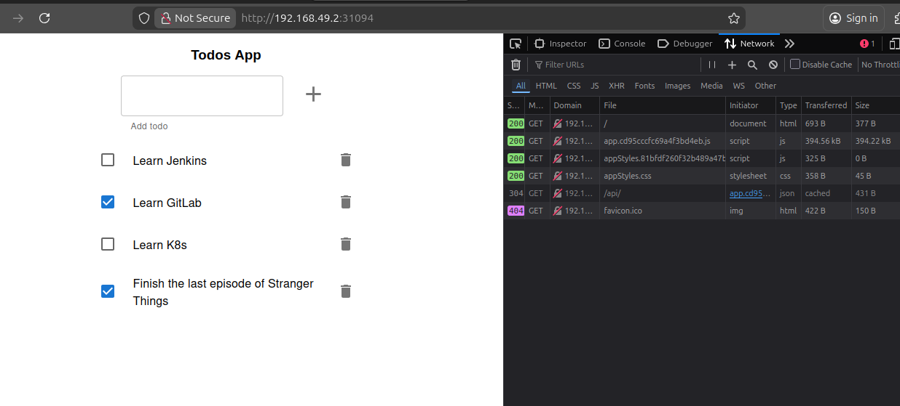