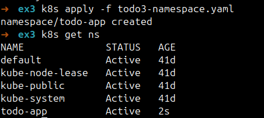
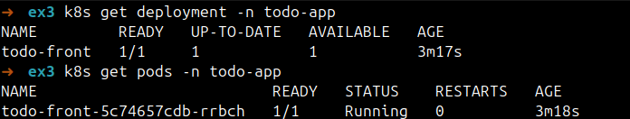
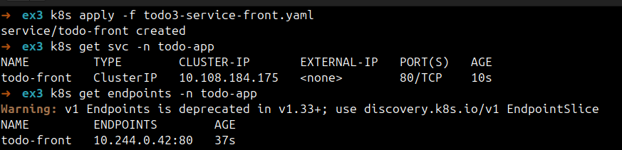
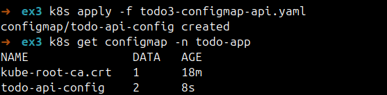
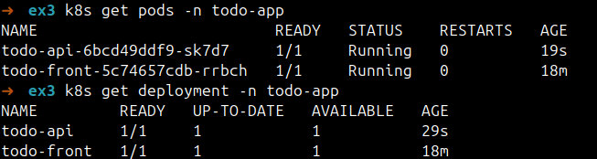
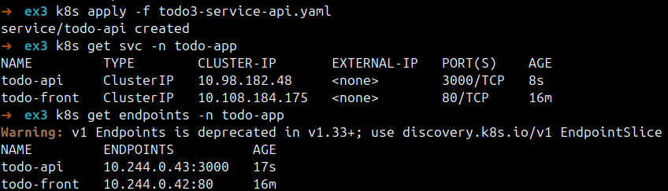
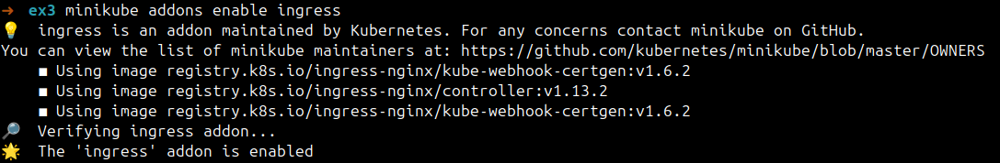
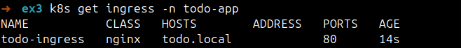
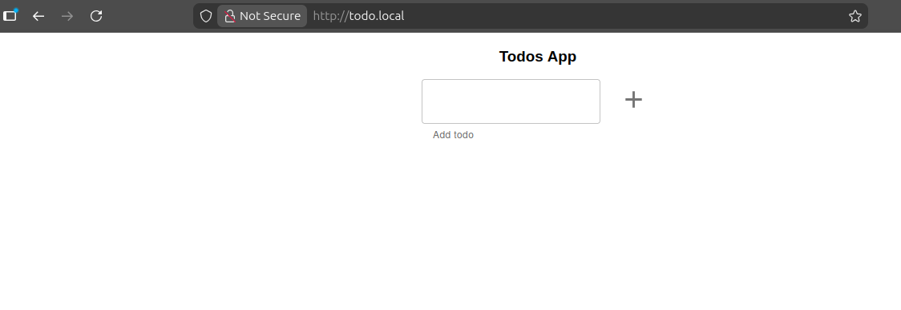
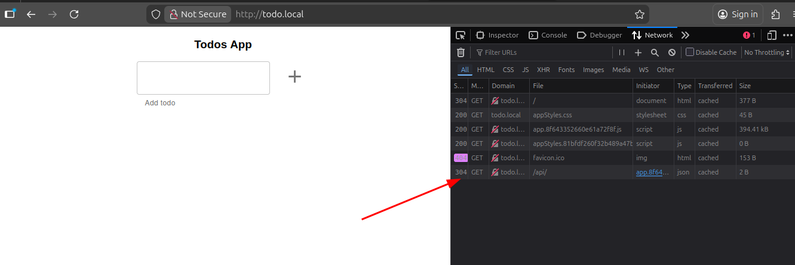

# Ejercicio 3

## PASO 1: Creamos un namespace llamado `todo-app`

```yaml
# todo3-namespace.yaml
apiVersion: v1
kind: Namespace
metadata:
  name: todo-app
```

Ejecutamos el siguiente comando para crear el namespace:

```bash
kubectl apply -f todo2-namespace.yaml
```

Comprobamos que se ha creado correctamente:

```bash
kubectl get ns
```



## PASO 2: Creamos un deployment para el frontend

```yaml
# todo3-deployment-front.yaml
apiVersion: apps/v1
kind: Deployment
metadata:
  name: todo-front
  namespace: todo-app
spec:
  replicas: 1
  selector:
    matchLabels:
      app: todo-front
  template:
    metadata:
      labels:
        app: todo-front
    spec:
      containers:
        - name: todo-front
          image: lemoncodersbc/lc-todo-front:v5-2024
          ports:
            - name: http
              containerPort: 80
```

Ejecutamos el siguiente comando para crear el deployment:

```bash
kubectl apply -f todo3-deployment-front.yaml
```

Comprobamos que se ha creado correctamente:

```bashbash
kubectl get deployments -n todo-app
kubectl get pods -n todo-app
```



## PASO 3: Creamos un service de tipo ClusterIP para el frontend

```yaml
# todo3-service-front.yaml
apiVersion: v1
kind: Service
metadata:
  name: todo-front
  namespace: todo-app
spec:
  type: ClusterIP
  selector:
    app: todo-front
  ports:
    - name: http
      port: 80
      targetPort: 80
```

Ejecutamos el siguiente comando para crear el servicio:

```bash
kubectl apply -f todo3-service-front.yaml
```

Comprobamos que se ha creado correctamente:

```bash
kubectl get svc -n todo-app
kubectl get endpoints -n todo-app
```



## PASO 4: Creamos un configmap para el backend

```yaml
# todo3-configmap-api.yaml
apiVersion: v1
kind: ConfigMap
metadata:
  name: todo-api-config
  namespace: todo-app
data:
  NODE_ENV: "development"
  PORT: "3000"
```

Ejecutamos el siguiente comando para crear el configmap:

```bash
kubectl apply -f todo3-configmap-api.yaml
```

Comprobamos que se ha creado correctamente:

```bash
kubectl get configmap -n todo-app
```



## PASO 5: Creamos un deployment para el backend

```yaml
# todo3-deployment-api.yaml
apiVersion: apps/v1
kind: Deployment
metadata:
  name: todo-api
  namespace: todo-app
spec:
  replicas: 1
  selector:
    matchLabels:
      app: todo-api
  template:
    metadata:
      labels:
        app: todo-api
    spec:
      containers:
        - name: todo-api
          image: lemoncodersbc/lc-todo-api:v5-2024
          ports:
            - name: http
              containerPort: 3000
          envFrom:
            - configMapRef:
                name: todo-api-config
```

Ejecutamos el siguiente comando para crear el deployment:

```bash
kubectl apply -f todo3-deployment-api.yaml
```

Comprobamos que se ha creado correctamente:

```bashbash
kubectl get pods -n todo-app
kubectl get deployments -n todo-app
```



## PASO 6: Creamos un service de tipo ClusterIP para el backend

```yaml
# todo3-service-api.yaml
apiVersion: v1
kind: Service
metadata:
  name: todo-api
  namespace: todo-app
spec:
  type: ClusterIP
  selector:
    app: todo-api
  ports:
    - name: http
      port: 3000
      targetPort: 3000
```

Ejecutamos el siguiente comando para crear el servicio:

```bash
kubectl apply -f todo3-service-api.yaml
```

Comprobamos que se ha creado correctamente:

```bash
kubectl get svc -n todo-app
kubectl get endpoints -n todo-app
```



## PASO 7: Activar Ingress en Minikube

```bash
minikube addons enable ingress
```



## PASO 8: Creamos el Ingress para la aplicación

```yaml
# todo3-ingress.yaml
apiVersion: networking.k8s.io/v1
kind: Ingress
metadata:
  name: todo-ingress
  namespace: todo-app
spec:
  ingressClassName: nginx
  rules:
    - host: todo.local
      http:
        paths:
          - path: /api
            pathType: Prefix
            backend:
              service:
                name: todo-api
                port:
                  number: 3000
          - path: /
            pathType: Prefix
            backend:
              service:
                name: todo-front
                port:
                  number: 80
```

Ejecutamos el siguiente comando para crear el Ingress:

```bash
kubectl apply -f todo3-ingress.yaml
```

Comprobamos que se ha creado correctamente:

```bash
kubectl get ingress -n todo-app
```



## PASO 9: Modificamos el archivo hosts de nuestro sistema

Añadimos la siguiente línea al archivo `/etc/hosts` para mapear el dominio `todo.local` a la IP de Minikube.

```bash
echo "$(minikube ip) todo.local" | sudo tee -a /etc/hosts
```

## PASO 10: Accedemos a la aplicación desde el navegador

Abrimos nuestro navegador y accedemos a la URL `http://todo.local`.




