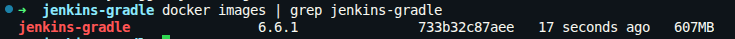
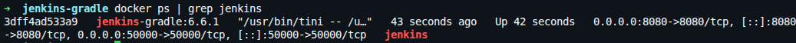
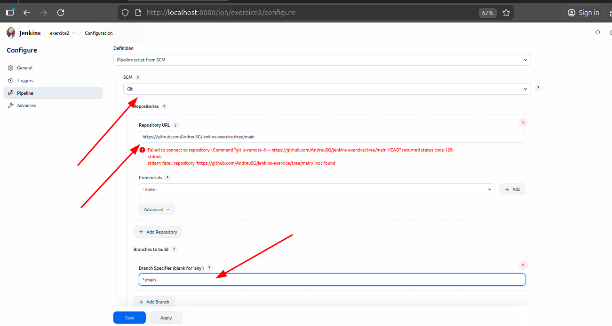
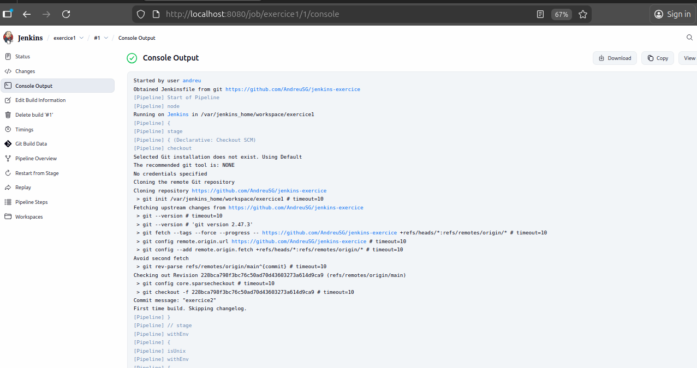
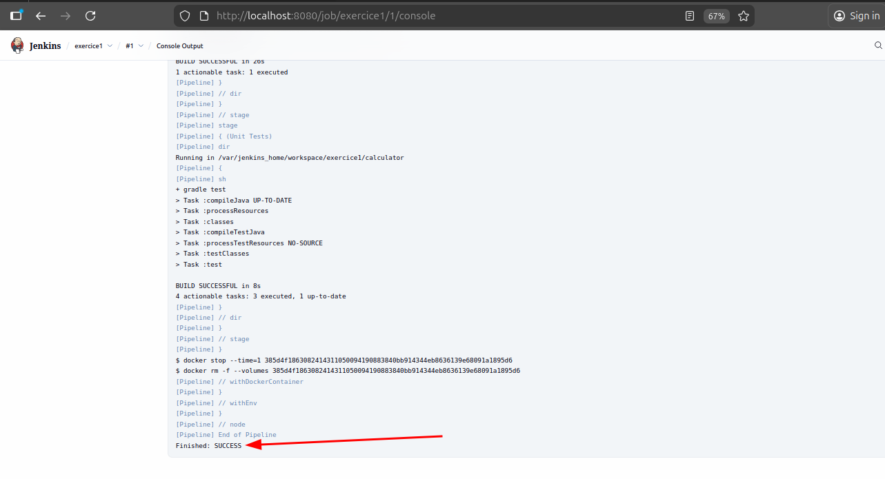
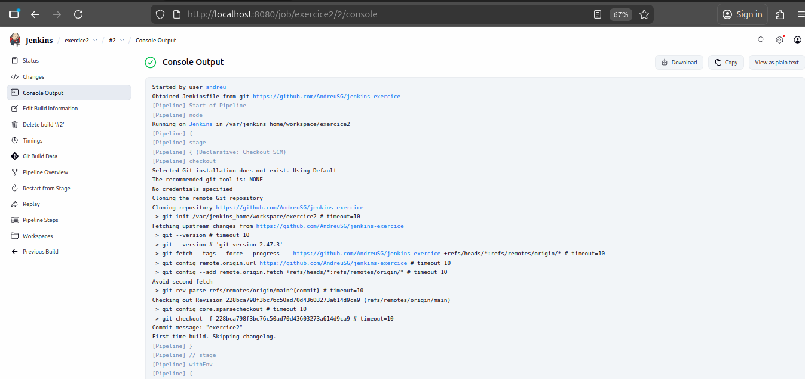

# Ejercicio 1 y 2

Construimos la imagen de Jenkins con Gradle que dice el enunciado:

Creamos un directorio para el proyecto y nos situamos en él:

```bash
mkdir jenkins-gradle
cd jenkins-gradle
```

Creamos el fichero `Dockerfile` con el siguiente contenido:

```Dockerfile
FROM jenkins/jenkins:lts-jdk11

USER root

# Reference install gradle: https://medium.com/@migueldoctor/how-to-create-a-custom-docker-image-with-jdk8-maven-and-gradle-ddc90f41cee4
RUN apt update

# Gradle version
ARG GRADLE_VERSION=6.6.1

# Define the URL where gradle can be downloaded
ARG GRADLE_BASE_URL=https://services.gradle.org/distributions

# Define the SHA key to validate the gradle download
ARG GRADLE_SHA=7873ed5287f47ca03549ab8dcb6dc877ac7f0e3d7b1eb12685161d10080910ac

# Create the directories, download gradle, validate the download
# install it remove download file and set links
RUN mkdir -p /usr/share/gradle /usr/share/gradle/ref \
  && echo "Downloading gradle hash" \
  && curl -fsSL -o /tmp/gradle.zip ${GRADLE_BASE_URL}/gradle-${GRADLE_VERSION}-bin.zip \
  && echo "Checking download hash" \
  && echo "${GRADLE_SHA} /tmp/gradle.zip" | sha256sum -c - \
  && echo "Unziping gradle" && unzip -d /usr/share/gradle /tmp/gradle.zip \
  && echo "Clenaing and setting links" && rm -f /tmp/gradle.zip \
  && ln -s /usr/share/gradle/gradle-${GRADLE_VERSION} /usr/bin/gradle

ENV GRADLE_VERSION 6.6.1
ENV GRADLE_HOME /usr/bin/gradle
ENV PATH $PATH:$GRADLE_HOME/bin
```

Construimos la imagen:

```bash
docker build -t jenkins-gradle:6.6.1 .
```

Comprobamos que la imagen se ha creado correctamente:

```bash
docker images | grep jenkins-gradle
```



Levantamos un contenedor con la imagen creada:

```bash
docker run -d \
  --name jenkins \
  -p 8080:8080 \
  -p 50000:50000 \
  -v jenkins_home:/var/jenkins_home \
  jenkins-gradle:6.6.1
```

Comprobamos que el contenedor se ha levantado correctamente:

```bash
docker ps | grep jenkins
```



Introducimos en el navegador la URL `http://localhost:8080` e introducimos la contraseña inicial:

```bash
docker exec jenkins cat /var/jenkins_home/secrets/initialAdminPassword
```

Este comando nos devuelve la contraseña que tenemos que introducir en el navegador.

Instalamos los plugins recomendados y creamos el usuario administrador.

Ahora copiamos el código fuente del enunciado y creamos un reositorio en nuestro github personal con ese código.

Creamos un Jenkinsfile en la raíz del proyecto con el siguiente contenido:

```groovy
pipeline {
    agent any

    stages {
        stage('Checkout') {
            steps {
                checkout scm
            }
        }

        stage('Compile') {
            steps {
                dir('calculator') {
                    sh './gradlew compileJava'
                }
            }
        }

        stage('Unit Tests') {
            steps {
                dir('calculator') {
                    sh './gradlew test'
                }
            }
        }
    }
}
```

Creamos un nuevo job en Jenkins de tipo Pipeline, configuramos el repositorio git y en la sección Pipeline seleccionamos "Pipeline script from SCM", seleccionamos Git y ponemos la URL del repositorio.



Guardamos y ejecutamos el job.






Ahora modificamos el Jenkinsfile para añadir docker-in-docker y construir una imagen docker con la aplicación compilada:

```groovy
pipeline {
    agent {
        docker {
            image 'gradle:6.6.1-jre14-openj9'
        }
    }

    stages {
        stage('Checkout') {
            steps {
                checkout scm
            }
        }

        stage('Compile') {
            steps {
                dir('calculator') {
                    sh 'gradle compileJava'
                }
            }
        }

        stage('Unit Tests') {
            steps {
                dir('calculator') {
                    sh 'gradle test'
                }
            }
        }
    }
}
```

