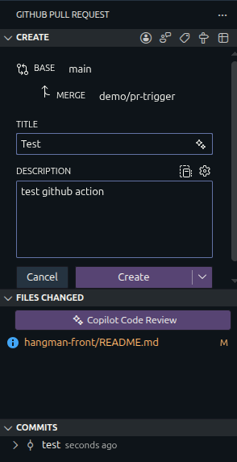
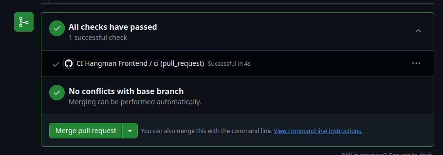
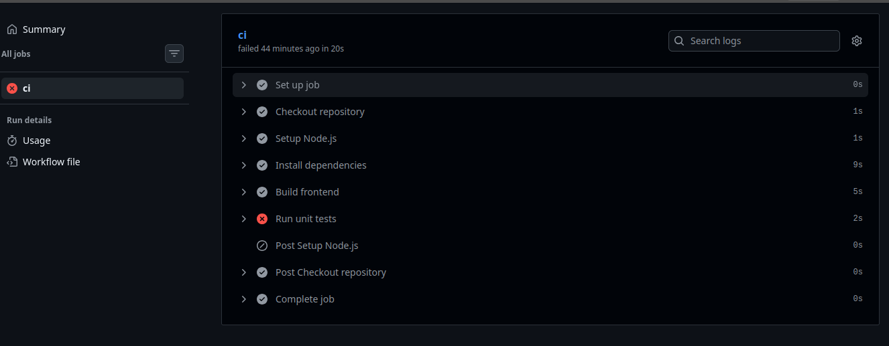
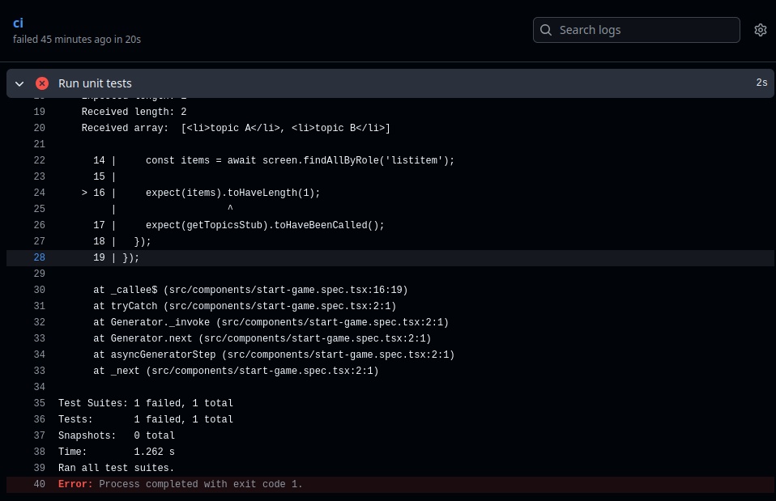

# Ejercicio 3

Primero de todo creamos un repositorio en nuestro github con el código fuente del enunciado.

Ahora creamos un directorio llamado .github en la raíz del proyecto y dentro de ese directorio creamos otro directorio llamado workflows. Dentro de ese directorio creamos un archivo llamado ci-hangman-front.yml. Hacemos commit y push de los cambios al repositorio.

```bash
mkdir -p .github/workflows
touch .github/workflows/ci-hangman-front.yml
git add .github/workflows/ci-hangman-front.yml
git commit -m "chore: add GitHub Actions workflows structure"
git push
```

Dentro del archivo ci-hangman-front.yml añadimos el siguiente contenido:

```yaml
name: CI Hangman Frontend

on:
  pull_request:
    paths:
      - 'hangman-front/**'

jobs:
  ci:
    runs-on: ubuntu-latest
    steps:
      - run: echo "Pull Request detected with changes in hangman-front"
```

Hacemos commit y push de los cambios al repositorio.

Después vamos a realizar las pruebas:

1. Creamos una nueva rama a partir de main:

```bash
git checkout -b demo/pr-trigger
```

2. Creamos un README.md dentro de la carpeta hangman-front:

```bash
echo "Test action" > hangman-front/README.md
```

3. Hacemos commit y push de los cambios a la nueva rama:

```bash
git add hangman-front/README.md
git commit -m "test"
git push --set-upstream origin demo/pr-trigger
```

4. Abrimos un Pull Request desde la rama demo/pr-trigger hacia main.



5. Comprobamos que el workflow se ha ejecutado correctamente:



Ahora vamos a modificar el workflow desde la rama main para que ejecute el build del proyecto y ejecutar los unit tests:

```yaml
name: CI Hangman Frontend

on:
  pull_request:
    paths:
      - 'hangman-front/**'

jobs:
  ci:
    runs-on: ubuntu-latest

    defaults:
      run:
        working-directory: hangman-front

    steps:
      - name: Checkout repository
        uses: actions/checkout@v4

      - name: Setup Node.js
        uses: actions/setup-node@v4
        with:
          node-version: 20
          cache: 'npm'
          cache-dependency-path: hangman-front/package-lock.json

      - name: Install dependencies
        run: npm ci

      - name: Build frontend
        run: npm run build

      - name: Run unit tests
        run: npm test
```

Hacemos commit y push de los cambios a la rama main.

Ahora vamos a comprobar que el workflow se ha ejecutado correctamente y que el build y los tests se han ejecutado correctamente:

Creamos de nuevo una rama a partir de main:

```bash
git checkout -b demo/pr-trigger-2
```

Modificamos el README.md para que se vuelva a ejecutar el workflow:

```bash
echo "Test action 2" > hangman-front/README.md
```

Hacemos commit y push de los cambios a la nueva rama y abrimos un Pull Request desde la rama demo/pr-trigger-2 hacia main.

Comprobamos que el workflow se ha ejecutado correctamente y que el build y los tests se han ejecutado. Podemos comprobar como el build se ejecuta correctamente y los tests fallan por un error en el código fuente:




