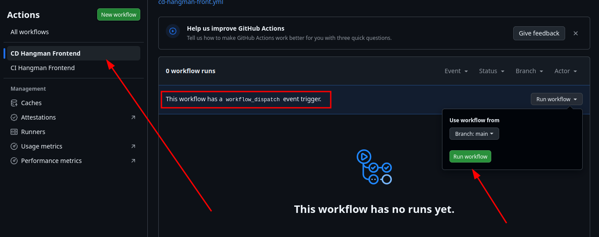
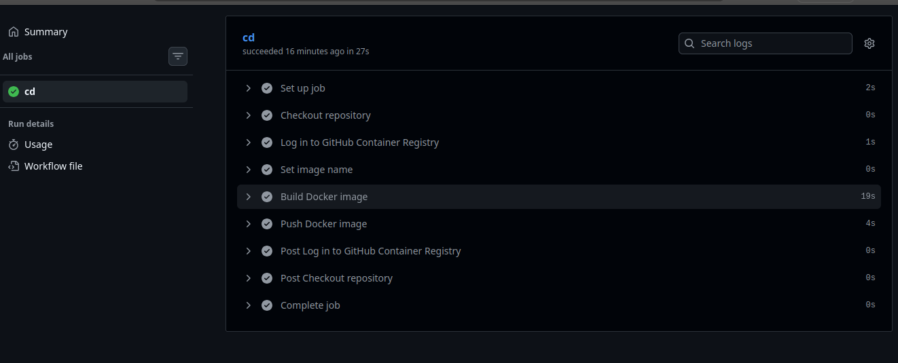

# Ejercicio 4

Creamos un nuevo workflow en la ruta .github/workflows/cd-hangman-front.yml

```yaml
name: CD Hangman Frontend

on: workflow_dispatch

permissions:
    contents: read
    packages: write

jobs:
    cd:
        runs-on: ubuntu-latest

        steps:
            - name: Checkout repository
              uses: actions/checkout@v4

            - name: Log in to GitHub Container Registry
              uses: docker/login-action@v3
              with:
                  registry: ghcr.io
                  username: ${{ github.actor }}
                  password: ${{ secrets.GITHUB_TOKEN }}

            - name: Set image name
              run: |
                  echo "IMAGE_NAME=ghcr.io/${GITHUB_REPOSITORY,,}/hangman-front:latest" >> $GITHUB_ENV

            - name: Build Docker image
              run: |
                  docker build -t $IMAGE_NAME ./hangman-front

            - name: Push Docker image
              run: |
                  docker push $IMAGE_NAME
```

Vamos a ejecutar el workflow manualmente como pide el enunciado.



 