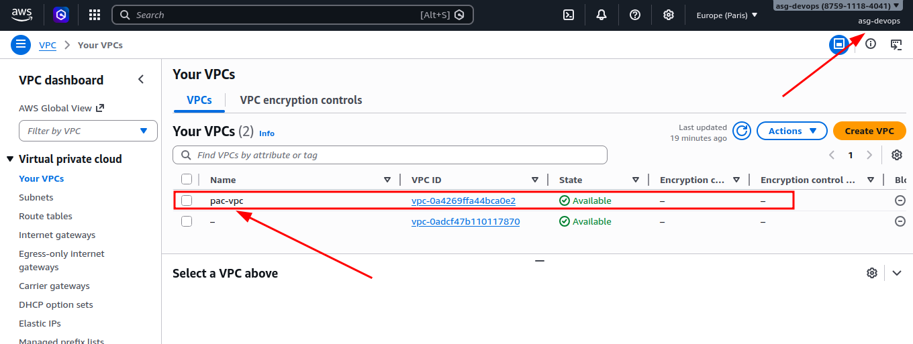
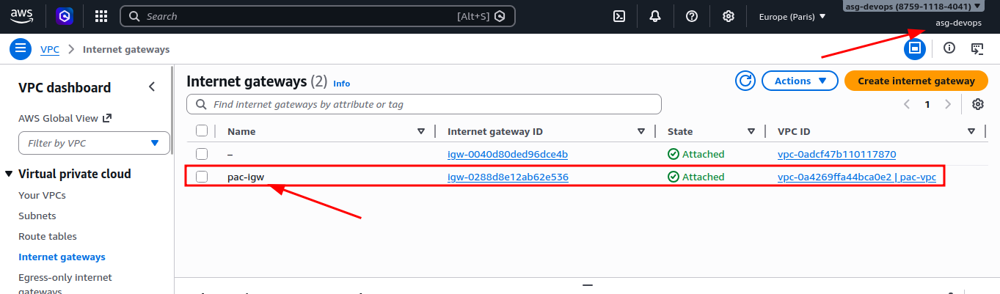

# Exercicio 1 – Creación de una VPC con acceso a Internet

## Preparación del entorno

Antes de comenzar preparé el entorno local para poder trabajar con Terraform y AWS.

### Pasos realizados

1. Creación de un usuario IAM específico para Terraform.
2. Instalación de AWS CLI.
3. Configuración de credenciales mediante `aws configure`.
4. Instalación de Terraform.
5. Inicialización del proyecto con `terraform init`.

## Creación de una VPC con acceso a Internet

### Provider

En mi caso elegí la región **eu-west-3 (París)** por su proximidad geográfica con España.

```hcl
provider "aws" {
  region = "eu-west-3"
}
```

### Creación de la VPC

Aquí creo una VPC con su bloque CIDR. También activo los nombres de host DNS para facilitar la resolución dentro de la VPC y le añado un tag para identificarla rápido en la consola de AWS.

```hcl
resource "aws_vpc" "pac_vpc" {
  cidr_block           = "10.0.0.0/16"
  enable_dns_hostnames = true

  tags = {
    Name = "pac-vpc"
  }
}
```

### Internet Gateway

Para que los recursos dentro de la VPC tengan salida a Internet, creo un Internet Gateway. Con `vpc_id` lo asocio a la VPC que acabo de crear.

```hcl
resource "aws_internet_gateway" "igw" {
  vpc_id = aws_vpc.pac_vpc.id

  tags = {
    Name = "pac-igw"
  }
}
```

### Ejecución de Terraform

El siguiente paso es lanzar el plan de Terraform para revisar exactamente qué cambios se van a aplicar en AWS:

```bash
terraform plan
```

Output recibido:

```
# aws_internet_gateway.igw will be created
  + resource "aws_internet_gateway" "igw" {
      + arn      = (known after apply)
      + id       = (known after apply)
      + owner_id = (known after apply)
      + region   = "eu-west-3"
      + tags     = {
          + "Name" = "pac-igw"
        }
      + tags_all = {
          + "Name" = "pac-igw"
        }
      + vpc_id   = (known after apply)
    }

  # aws_vpc.pac_vpc will be created
  + resource "aws_vpc" "pac_vpc" {
      + arn                                  = (known after apply)
      + cidr_block                           = "10.0.0.0/16"
      + default_network_acl_id               = (known after apply)
      + default_route_table_id               = (known after apply)
      + default_security_group_id            = (known after apply)
      + dhcp_options_id                      = (known after apply)
      + enable_dns_hostnames                 = true
      + enable_dns_support                   = true
      + enable_network_address_usage_metrics = (known after apply)
      + id                                   = (known after apply)
      + instance_tenancy                     = "default"
      + ipv6_association_id                  = (known after apply)
      + ipv6_cidr_block                      = (known after apply)
      + ipv6_cidr_block_network_border_group = (known after apply)
      + main_route_table_id                  = (known after apply)
      + owner_id                             = (known after apply)
      + region                               = "eu-west-3"
      + tags                                 = {
          + "Name" = "pac-vpc"
        }
      + tags_all                             = {
          + "Name" = "pac-vpc"
        }
    }

Plan: 2 to add, 0 to change, 0 to destroy.
```

Aquí veo que se van a crear los recursos que he definido. Cuando está todo correcto, aplico los cambios con:

```bash
terraform apply
```
Output recibido:

```
aws_vpc.pac_vpc: Creating...
aws_vpc.pac_vpc: Creation complete after 6s [id=vpc-0a4269ffa44bca0e2]
aws_internet_gateway.igw: Creating...
aws_internet_gateway.igw: Creation complete after 1s [id=igw-0288d8e12ab62e536]

Apply complete! Resources: 2 added, 0 changed, 0 destroyed.
```

## Verificación de la creación de la VPC

Compruebo en la consola de AWS que la VPC se ha creado correctamente:



También lo verifico desde terminal con Terraform para asegurarme de que el estado coincide:

```bash
terraform state show aws_vpc.pac_vpc
```
Output recibido:

```
# aws_vpc.pac_vpc:
resource "aws_vpc" "pac_vpc" {
    arn                                  = "arn:aws:ec2:eu-west-3:875911184041:vpc/vpc-0a4269ffa44bca0e2"
    assign_generated_ipv6_cidr_block     = false
    cidr_block                           = "10.0.0.0/16"
    default_network_acl_id               = "acl-0a52819e423cfb244"
    default_route_table_id               = "rtb-0c3ca689743a4e569"
    default_security_group_id            = "sg-068324dc5d3a633d0"
    dhcp_options_id                      = "dopt-08f902e744bab2e37"
    enable_dns_hostnames                 = true
    enable_dns_support                   = true
    enable_network_address_usage_metrics = false
    id                                   = "vpc-0a4269ffa44bca0e2"
    instance_tenancy                     = "default"
    ipv6_association_id                  = null
    ipv6_cidr_block                      = null
    ipv6_cidr_block_network_border_group = null
    ipv6_ipam_pool_id                    = null
    ipv6_netmask_length                  = 0
    main_route_table_id                  = "rtb-0c3ca689743a4e569"
    owner_id                             = "875911184041"
    region                               = "eu-west-3"
    tags                                 = {
        "Name" = "pac-vpc"
    }
    tags_all                             = {
        "Name" = "pac-vpc"
    }
}
```

Con esto confirmo que la VPC se creó con el bloque CIDR correcto y con el tag que le asigné.

## Verificación de la creación del Internet Gateway

Compruebo en la consola de AWS que el Internet Gateway se ha creado correctamente:



Después lo reviso desde terminal para validar también el Internet Gateway:

```bash
terraform state show aws_internet_gateway.igw
```

Output recibido:

```
# aws_internet_gateway.igw:
resource "aws_internet_gateway" "igw" {
    arn      = "arn:aws:ec2:eu-west-3:875911184041:internet-gateway/igw-0288d8e12ab62e536"
    id       = "igw-0288d8e12ab62e536"
    owner_id = "875911184041"
    region   = "eu-west-3"
    tags     = {
        "Name" = "pac-igw"
    }
    tags_all = {
        "Name" = "pac-igw"
    }
    vpc_id   = "vpc-0a4269ffa44bca0e2"
}
```