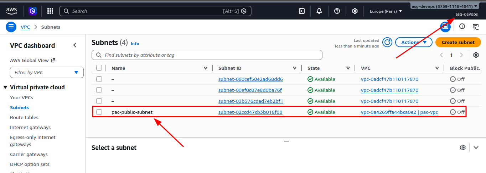
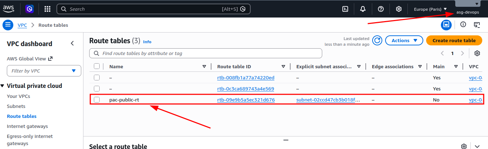
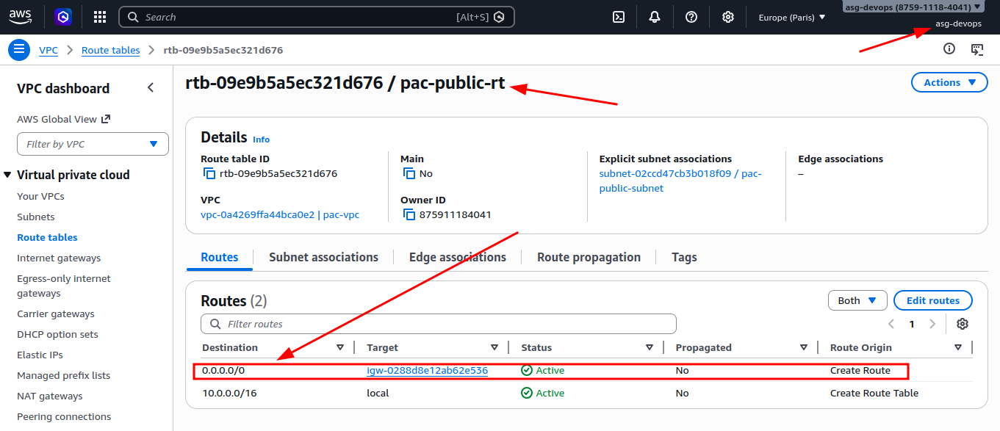
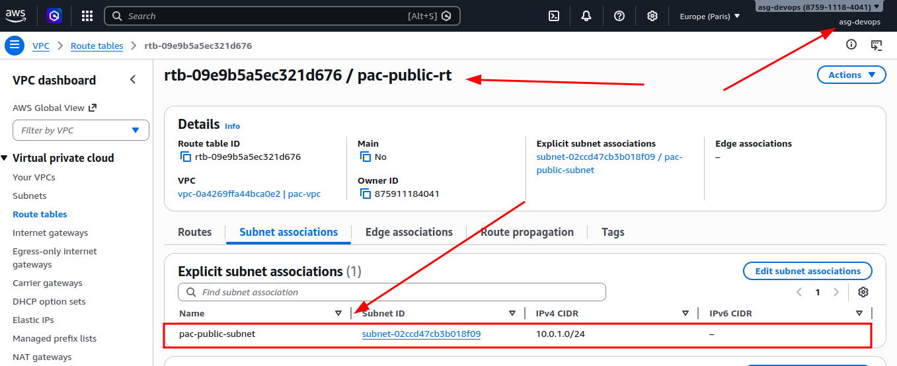

# Ejercicio 2 – Creación de una Subnet con acceso a Internet

## Creación de la Subnet

Aquí usamos el bloque CIDR `10.0.1.0/24` para sacar una subred dentro de la red principal de la VPC.

Además, con `map_public_ip_on_launch = true` conseguimos que cualquier instancia que lance en esta subnet tenga **IP pública** automáticamente.

```hcl
resource "aws_subnet" "public_subnet" {
  vpc_id                  = aws_vpc.pac_vpc.id
  cidr_block              = "10.0.1.0/24"
  map_public_ip_on_launch = true

  tags = {
    Name = "pac-public-subnet"
  }
}
```

## Creación de la Route Table

En este paso creo la tabla de rutas para la VPC que monté en el ejercicio anterior.

```hcl
resource "aws_route_table" "public_rt" {
  vpc_id = aws_vpc.pac_vpc.id

  tags = {
    Name = "pac-public-rt"
  }
}
```

## Creación de la ruta hacia Internet

Aquí añado la ruta por defecto (`0.0.0.0/0`) para que todo el tráfico salga por el Internet Gateway.

```hcl
resource "aws_route" "internet_access" {
  route_table_id         = aws_route_table.public_rt.id
  destination_cidr_block = "0.0.0.0/0"
  gateway_id             = aws_internet_gateway.igw.id
}
```

## Asociación de la Route Table con la Subnet

Para que esta subnet use esa tabla de rutas, la asocio directamente.

```hcl
resource "aws_route_table_association" "public_assoc" {
  subnet_id      = aws_subnet.public_subnet.id
  route_table_id = aws_route_table.public_rt.id
}
```

## Ejecución de Terraform

Primero lanzo el `terraform plan` para revisar qué recursos se van a crear antes de aplicar nada.

```bash
terraform plan
```
Output recibido:

```
# aws_route.internet_access will be created
  + resource "aws_route" "internet_access" {
      + destination_cidr_block = "0.0.0.0/0"
      + gateway_id             = "igw-0288d8e12ab62e536"
      + id                     = (known after apply)
      + instance_id            = (known after apply)
      + instance_owner_id      = (known after apply)
      + network_interface_id   = (known after apply)
      + origin                 = (known after apply)
      + region                 = "eu-west-3"
      + route_table_id         = (known after apply)
      + state                  = (known after apply)
    }

  # aws_route_table.public_rt will be created
  + resource "aws_route_table" "public_rt" {
      + arn              = (known after apply)
      + id               = (known after apply)
      + owner_id         = (known after apply)
      + propagating_vgws = (known after apply)
      + region           = "eu-west-3"
      + route            = (known after apply)
      + tags             = {
          + "Name" = "pac-public-rt"
        }
      + tags_all         = {
          + "Name" = "pac-public-rt"
        }
      + vpc_id           = "vpc-0a4269ffa44bca0e2"
    }

  # aws_route_table_association.public_assoc will be created
  + resource "aws_route_table_association" "public_assoc" {
      + id             = (known after apply)
      + region         = "eu-west-3"
      + route_table_id = (known after apply)
      + subnet_id      = (known after apply)
    }

  # aws_subnet.public_subnet will be created
  + resource "aws_subnet" "public_subnet" {
      + arn                                            = (known after apply)
      + assign_ipv6_address_on_creation                = false
      + availability_zone                              = (known after apply)
      + availability_zone_id                           = (known after apply)
      + cidr_block                                     = "10.0.1.0/24"
      + enable_dns64                                   = false
      + enable_resource_name_dns_a_record_on_launch    = false
      + enable_resource_name_dns_aaaa_record_on_launch = false
      + id                                             = (known after apply)
      + ipv6_cidr_block                                = (known after apply)
      + ipv6_cidr_block_association_id                 = (known after apply)
      + ipv6_native                                    = false
      + map_public_ip_on_launch                        = true
      + owner_id                                       = (known after apply)
      + private_dns_hostname_type_on_launch            = (known after apply)
      + region                                         = "eu-west-3"
      + tags                                           = {
          + "Name" = "pac-public-subnet"
        }
      + tags_all                                       = {
          + "Name" = "pac-public-subnet"
        }
      + vpc_id                                         = "vpc-0a4269ffa44bca0e2"
    }

Plan: 4 to add, 0 to change, 0 to destroy.
```

Cuando veo que el plan está bien, ejecuto el apply para crear los recursos en AWS.

```bash
terraform apply
```

Output recibido:

```
aws_route_table.public_rt: Creating...
aws_subnet.public_subnet: Creating...
aws_route_table.public_rt: Creation complete after 2s [id=rtb-09e9b5a5ec321d676]
aws_route.internet_access: Creating...
aws_route.internet_access: Creation complete after 2s [id=r-rtb-09e9b5a5ec321d6761080289494]
aws_subnet.public_subnet: Still creating... [00m10s elapsed]
aws_subnet.public_subnet: Creation complete after 13s [id=subnet-02ccd47cb3b018f09]
aws_route_table_association.public_assoc: Creating...
aws_route_table_association.public_assoc: Creation complete after 1s [id=rtbassoc-04c7ed937d5352d0d]

Apply complete! Resources: 4 added, 0 changed, 0 destroyed.
```

## Verificación de la creación de la Subnet

Compruebo en la consola de AWS que la Subnet se ha creado correctamente:



También lo verifico desde terminal con Terraform para asegurarme de que el estado coincide:

```bash
terraform state show aws_subnet.public_subnet
```
Output recibido:

```
# aws_subnet.public_subnet:
resource "aws_subnet" "public_subnet" {
    arn                                            = "arn:aws:ec2:eu-west-3:875911184041:subnet/subnet-02ccd47cb3b018f09"
    assign_ipv6_address_on_creation                = false
    availability_zone                              = "eu-west-3c"
    availability_zone_id                           = "euw3-az3"
    cidr_block                                     = "10.0.1.0/24"
    customer_owned_ipv4_pool                       = null
    enable_dns64                                   = false
    enable_lni_at_device_index                     = 0
    enable_resource_name_dns_a_record_on_launch    = false
    enable_resource_name_dns_aaaa_record_on_launch = false
    id                                             = "subnet-02ccd47cb3b018f09"
    ipv6_cidr_block                                = null
    ipv6_cidr_block_association_id                 = null
    ipv6_native                                    = false
    map_customer_owned_ip_on_launch                = false
    map_public_ip_on_launch                        = true
    outpost_arn                                    = null
    owner_id                                       = "875911184041"
    private_dns_hostname_type_on_launch            = "ip-name"
    region                                         = "eu-west-3"
    tags                                           = {
        "Name" = "pac-public-subnet"
    }
    tags_all                                       = {
        "Name" = "pac-public-subnet"
    }
    vpc_id                                         = "vpc-0a4269ffa44bca0e2"
}
```

## Verificación de la creación de la Route Table

Compruebo en la consola de AWS que la Route Table se ha creado correctamente:



También lo reviso desde terminal para confirmar que todo quedó bien:

```bash
terraform state show aws_route_table.public_rt
```
Output recibido:

```
# aws_route_table.public_rt:
resource "aws_route_table" "public_rt" {
    arn              = "arn:aws:ec2:eu-west-3:875911184041:route-table/rtb-09e9b5a5ec321d676"
    id               = "rtb-09e9b5a5ec321d676"
    owner_id         = "875911184041"
    propagating_vgws = []
    region           = "eu-west-3"
    route            = []
    tags             = {
        "Name" = "pac-public-rt"
    }
    tags_all         = {
        "Name" = "pac-public-rt"
    }
    vpc_id           = "vpc-0a4269ffa44bca0e2"
}
```

## Verificación de la creación de la ruta hacia Internet

Compruebo en la consola de AWS que la ruta hacia Internet se ha creado correctamente:



Después lo verifico desde terminal para validar la ruta creada:

```bash
terraform state show aws_route.internet_access
```

Output recibido:

```
# aws_route.internet_access:
resource "aws_route" "internet_access" {
    carrier_gateway_id          = null
    core_network_arn            = null
    destination_cidr_block      = "0.0.0.0/0"
    destination_ipv6_cidr_block = null
    destination_prefix_list_id  = null
    egress_only_gateway_id      = null
    gateway_id                  = "igw-0288d8e12ab62e536"
    id                          = "r-rtb-09e9b5a5ec321d6761080289494"
    instance_id                 = null
    instance_owner_id           = null
    local_gateway_id            = null
    nat_gateway_id              = null
    network_interface_id        = null
    origin                      = "CreateRoute"
    region                      = "eu-west-3"
    route_table_id              = "rtb-09e9b5a5ec321d676"
    state                       = "active"
    transit_gateway_id          = null
    vpc_endpoint_id             = null
    vpc_peering_connection_id   = null
}
```

## Verificación de la asociación de la Route Table con la Subnet

Compruebo en la consola de AWS que la asociación entre la Route Table y la Subnet se ha creado correctamente:



Y por último lo reviso desde terminal para confirmar la asociación:

```bash
terraform state show aws_route_table_association.public_assoc
```

Output recibido:

```
# aws_route_table_association.public_assoc:
resource "aws_route_table_association" "public_assoc" {
    gateway_id     = null
    id             = "rtbassoc-04c7ed937d5352d0d"
    region         = "eu-west-3"
    route_table_id = "rtb-09e9b5a5ec321d676"
    subnet_id      = "subnet-02ccd47cb3b018f09"
}
```