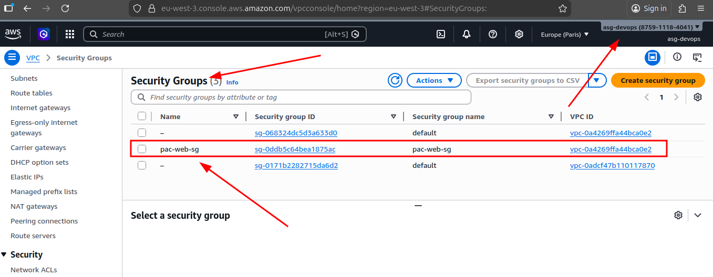
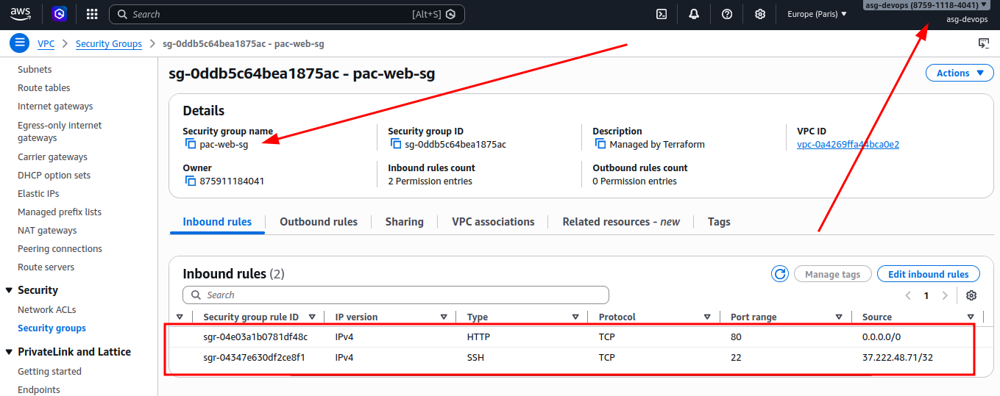
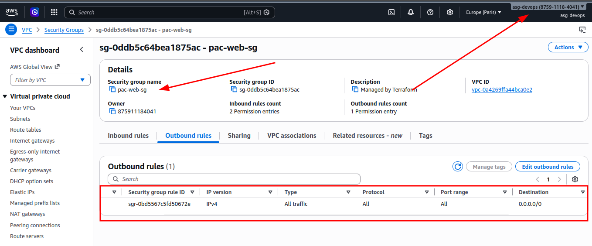

# Ejercicio 3 – Security Group

## Crear un Security Group para permitir tráfico HTTP

En este paso creo un Security Group asociado a la VPC para controlar el tráfico de red de las instancias. Añado una regla de entrada (ingress) al Security Group que permite tráfico HTTP (puerto 80) desde cualquier dirección IP (0.0.0.0/0), con el objetivo de permitir el acceso web al servidor.

```hcl
resource "aws_security_group" "web_sg" {
  name   = "pac-web-sg"
  vpc_id = aws_vpc.pac_vpc.id

  # HTTP access from anywhere
  ingress {
    from_port   = 80
    to_port     = 80
    protocol    = "tcp"
    cidr_blocks = ["0.0.0.0/0"]
  }

  tags = {
    Name = "pac-web-sg"
  }
}
```

### Ejecución solo el plan para revisar los cambios

```bash
terraform plan
```

Output recibido:

```
# aws_security_group.web_sg will be created
  + resource "aws_security_group" "web_sg" {
      + arn                    = (known after apply)
      + description            = "Managed by Terraform"
      + egress                 = (known after apply)
      + id                     = (known after apply)
      + ingress                = [
          + {
              + cidr_blocks      = [
                  + "0.0.0.0/0",
                ]
              + from_port        = 80
              + ipv6_cidr_blocks = []
              + prefix_list_ids  = []
              + protocol         = "tcp"
              + security_groups  = []
              + self             = false
              + to_port          = 80
                # (1 unchanged attribute hidden)
            },
        ]
      + name                   = "pac-web-sg"
      + name_prefix            = (known after apply)
      + owner_id               = (known after apply)
      + region                 = "eu-west-3"
      + revoke_rules_on_delete = false
      + tags                   = {
          + "Name" = "pac-web-sg"
        }
      + tags_all               = {
          + "Name" = "pac-web-sg"
        }
      + vpc_id                 = "vpc-0a4269ffa44bca0e2"
    }

Plan: 1 to add, 0 to change, 0 to destroy.
```

Veo que se va a crear el recurso `aws_security_group.web_sg` con la configuración esperada. Antes de aplicar los cambios, hago la parte opcional y añado una regla para acceso SSH solo desde mi IP pública.

## Añadir regla de acceso SSH desde mi IP pública

Primero consulto mi IP pública:

```bash
curl ifconfig.me
```

Output recibido:

```
37.222.48.71
```

Esta es mi IP publica en este momento y, para esta PAC, la uso solo como referencia puntual para limitar el acceso SSH.

Con esa IP, añado la regla de acceso SSH al Security Group para que solo pueda conectarme yo:

```hcl
# SSH access from my IP
ingress {
  from_port   = 22
  to_port     = 22
  protocol    = "tcp"
  cidr_blocks = ["37.222.48.71/32"]
}
```

Por último, añado una regla de salida (egress) para permitir todo el tráfico de salida desde las instancias:

```hcl
# Allow all outbound traffic
egress {
  from_port   = 0
  to_port     = 0
  protocol    = "-1"
  cidr_blocks = ["0.0.0.0/0"]
}
```

## Script final del Security Group

Así queda el recurso completo al terminar el ejercicio, con acceso HTTP público y acceso SSH restringido a mi IP:

```hcl
resource "aws_security_group" "web_sg" {
  name   = "pac-web-sg"
  vpc_id = aws_vpc.pac_vpc.id

  # HTTP access from anywhere
  ingress {
    from_port   = 80
    to_port     = 80
    protocol    = "tcp"
    cidr_blocks = ["0.0.0.0/0"]
  }

  # SSH access from my IP
  ingress {
    from_port   = 22
    to_port     = 22
    protocol    = "tcp"
    cidr_blocks = ["37.222.48.71/32"]
  }

  # Allow all outbound traffic
  egress {
    from_port   = 0
    to_port     = 0
    protocol    = "-1"
    cidr_blocks = ["0.0.0.0/0"]
  }

  tags = {
    Name = "pac-web-sg"
  }
}
```

### Ejecución de Terraform para aplicar los cambios

```bash
terraform plan
```

Output recibido:

```
# aws_security_group.web_sg will be created
  + resource "aws_security_group" "web_sg" {
      + arn                    = (known after apply)
      + description            = "Managed by Terraform"
      + egress                 = (known after apply)
      + id                     = (known after apply)
      + ingress                = [
          + {
              + cidr_blocks      = [
                  + "0.0.0.0/0",
                ]
              + from_port        = 80
              + ipv6_cidr_blocks = []
              + prefix_list_ids  = []
              + protocol         = "tcp"
              + security_groups  = []
              + self             = false
              + to_port          = 80
                # (1 unchanged attribute hidden)
            },
          + {
              + cidr_blocks      = [
                  + "37.222.48.71/32",
                ]
              + from_port        = 22
              + ipv6_cidr_blocks = []
              + prefix_list_ids  = []
              + protocol         = "tcp"
              + security_groups  = []
              + self             = false
              + to_port          = 22
                # (1 unchanged attribute hidden)
            },
        ]
      + name                   = "pac-web-sg"
      + name_prefix            = (known after apply)
      + owner_id               = (known after apply)
      + region                 = "eu-west-3"
      + revoke_rules_on_delete = false
      + tags                   = {
          + "Name" = "pac-web-sg"
        }
      + tags_all               = {
          + "Name" = "pac-web-sg"
        }
      + vpc_id                 = "vpc-0a4269ffa44bca0e2"
    }

Plan: 1 to add, 0 to change, 0 to destroy.
```

Aplico los cambios para crear el Security Group en AWS:

```bash
terraform apply
```

Output recibido:

```
aws_security_group.web_sg: Creating...
aws_security_group.web_sg: Creation complete after 6s [id=sg-0ddb5c64bea1875ac]

Apply complete! Resources: 1 added, 0 changed, 0 destroyed.
```

## Verificación de la creación del Security Group

Compruebo en la consola de AWS que el Security Group se ha creado correctamente y que tiene las reglas de ingreso configuradas como esperaba.







Y por último, verifico desde terminal:

```bash
terraform state show aws_security_group.web_sg
```

Output recibido:

```
# aws_security_group.web_sg:
resource "aws_security_group" "web_sg" {
    arn                    = "arn:aws:ec2:eu-west-3:875911184041:security-group/sg-0ddb5c64bea1875ac"
    description            = "Managed by Terraform"
    egress                 = [
        {
            cidr_blocks      = [
                "0.0.0.0/0",
            ]
            description      = null
            from_port        = 0
            ipv6_cidr_blocks = []
            prefix_list_ids  = []
            protocol         = "-1"
            security_groups  = []
            self             = false
            to_port          = 0
        },
    ]
    id                     = "sg-0ddb5c64bea1875ac"
    ingress                = [
        {
            cidr_blocks      = [
                "0.0.0.0/0",
            ]
            description      = null
            from_port        = 80
            ipv6_cidr_blocks = []
            prefix_list_ids  = []
            protocol         = "tcp"
            security_groups  = []
            self             = false
            to_port          = 80
        },
        {
            cidr_blocks      = [
                "37.222.48.71/32",
            ]
            description      = null
            from_port        = 22
            ipv6_cidr_blocks = []
            prefix_list_ids  = []
            protocol         = "tcp"
            security_groups  = []
            self             = false
            to_port          = 22
        },
    ]
    name                   = "pac-web-sg"
    name_prefix            = null
    owner_id               = "875911184041"
    region                 = "eu-west-3"
    revoke_rules_on_delete = false
    tags                   = {
        "Name" = "pac-web-sg"
    }
    tags_all               = {
        "Name" = "pac-web-sg"
    }
    vpc_id                 = "vpc-0a4269ffa44bca0e2"
}
```