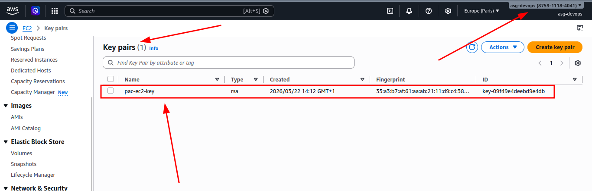

# Ejercicio 4 – Key Pair

## Crear un Key Pair para acceso SSH a las instancias

Genero un par de claves SSH en local y creo un recurso `aws_key_pair` en Terraform para registrar la clave publica en AWS. Con esto puedo usar esa clave para conectarme de forma segura a la instancia EC2.

## Generar las claves SSH en local

Primero creo el par de claves en mi equipo:

```bash
ssh-keygen -t rsa -b 4096 -f ~/.ssh/pac_ec2_key
```

Este comando me genera:

- Clave privada: `~/.ssh/pac_ec2_key`
- Clave publica: `~/.ssh/pac_ec2_key.pub`

Después ajusto permisos de la clave privada para evitar problemas al conectar por SSH:

```bash
chmod 400 ~/.ssh/pac_ec2_key
```

## Registrar la clave publica en AWS con Terraform

Con la clave publica ya creada, defino el recurso `aws_key_pair` para que AWS la registre y luego pueda asociarla a la EC2:

```hcl
resource "aws_key_pair" "pac_key" {
	key_name   = "pac-ec2-key"
	public_key = file("~/.ssh/pac_ec2_key.pub")
}
```

## Ejecucion de Terraform

Primero reviso los cambios:

```bash
terraform plan
```

output recibido:

```
# aws_key_pair.pac_key will be created
  + resource "aws_key_pair" "pac_key" {
      + arn             = (known after apply)
      + fingerprint     = (known after apply)
      + id              = (known after apply)
      + key_name        = "pac-ec2-key"
      + key_name_prefix = (known after apply)
      + key_pair_id     = (known after apply)
      + key_type        = (known after apply)
      + public_key      = "ssh-rsa ClaveSecretaQueNoPondré== kelsier@mistborn"
      + region          = "eu-west-3"
      + tags_all        = (known after apply)
    }

Plan: 1 to add, 0 to change, 0 to destroy.

Si el plan esta correcto, aplico:

```bash
terraform apply
```

Output recibido:

```
aws_key_pair.pac_key: Creating...
aws_key_pair.pac_key: Creation complete after 1s [id=pac-ec2-key]

Apply complete! Resources: 1 added, 0 changed, 0 destroyed.
```

## Verificación de la creación del Key Pair

Compruebo en la consola de AWS que el Key Pair se ha creado correctamente y que la clave publica es la que he registrado.



Y por último, verifico desde terminal:

```bash
terraform state show aws_key_pair.pac_key
```

Output recibido:

```
# aws_key_pair.pac_key:
resource "aws_key_pair" "pac_key" {
    arn             = "arn:aws:ec2:eu-west-3:875911184041:key-pair/pac-ec2-key"
    fingerprint     = "35:a3:b7:af:61:aa:ab:21:11:d9:c4:38:c3:c8:17:e8"
    id              = "pac-ec2-key"
    key_name        = "pac-ec2-key"
    key_name_prefix = null
    key_pair_id     = "key-09f49e4deebd9e4db"
    key_type        = "rsa"
    public_key      = "ssh-rsa ClaveSecretaQueNoPondré == kelsier@mistborn"
    region          = "eu-west-3"
    tags_all        = {}
}
```