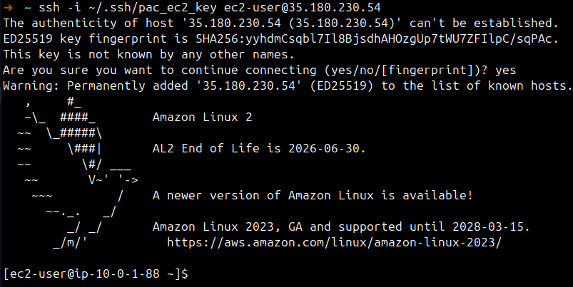
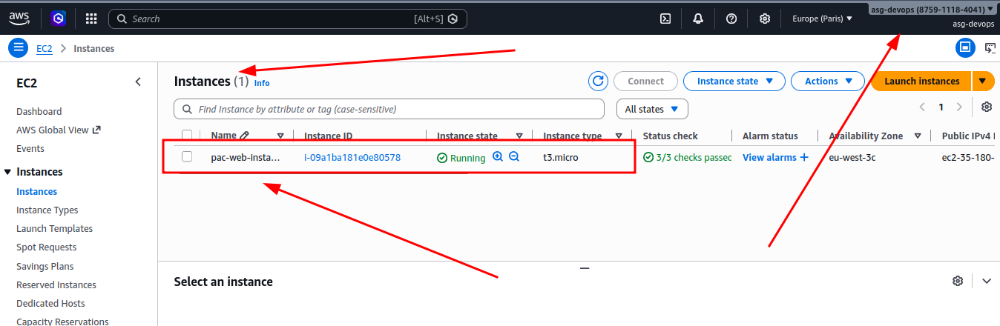

# Ejercicio 5 – EC2

## Crear una instancia EC2 en la subnet publica

En este ejercicio creo una instancia EC2 dentro de la subnet que configure en el ejercicio 2, le asocio el key pair del ejercicio 4 y me conecto por SSH.

Importante: para cumplir el requisito de free tier, uso una AMI de Amazon Linux 2 (x86_64) y tipo de instancia `t3.micro`.

## Buscar una AMI free tier de Amazon Linux 2

Para no depender de un ID fijo, primero defino un `data` source que busca la AMI mas reciente de Amazon Linux 2 en mi region.

```hcl
data "aws_ami" "amazon_linux_2" {
	most_recent = true
	owners      = ["amazon"]

	filter {
		name   = "name"
		values = ["amzn2-ami-hvm-*-x86_64-gp2"]
	}

	filter {
		name   = "virtualization-type"
		values = ["hvm"]
	}
}
```

## Crear la instancia EC2

La instancia obtiene una IP publica automaticamente al desplegarse en la subnet (`aws_subnet.public_subnet`), que ya tiene activado `map_public_ip_on_launch` y salida a Internet mediante el Internet Gateway que configuré en ejercicios anteriores. Ademas, le asocio el Security Group del ejercicio 3.

Tambien vinculo el key pair con `key_name = aws_key_pair.pac_key.key_name` para poder conectarme por SSH de forma segura.

```hcl
resource "aws_instance" "web_instance" {
	ami                    = data.aws_ami.amazon_linux_2.id
	instance_type          = "t3.micro"
	subnet_id              = aws_subnet.public_subnet.id
	vpc_security_group_ids = [aws_security_group.web_sg.id]
	key_name               = aws_key_pair.pac_key.key_name

	tags = {
		Name = "pac-web-instance"
	}
}
```

## Output de la IP publica

Para conectarme facil por SSH, saco la IP publica como output.

```hcl
output "web_instance_public_ip" {
	value = aws_instance.web_instance.public_ip
}
```

## Ejecucion de Terraform

Primero reviso el plan:

```bash
terraform plan
```

Output recibido:

```
# aws_instance.web_instance will be created
  + resource "aws_instance" "web_instance" {
      + ami                                  = "ami-011fc4a229f0661be"
      + arn                                  = (known after apply)
      + associate_public_ip_address          = (known after apply)
      + availability_zone                    = (known after apply)
      + disable_api_stop                     = (known after apply)
      + disable_api_termination              = (known after apply)
      + ebs_optimized                        = (known after apply)
      + enable_primary_ipv6                  = (known after apply)
      + force_destroy                        = false
      + get_password_data                    = false
      + host_id                              = (known after apply)
      + host_resource_group_arn              = (known after apply)
      + iam_instance_profile                 = (known after apply)
      + id                                   = (known after apply)
      + instance_initiated_shutdown_behavior = (known after apply)
      + instance_lifecycle                   = (known after apply)
      + instance_state                       = (known after apply)
      + instance_type                        = "t3.micro"
      + ipv6_address_count                   = (known after apply)
      + ipv6_addresses                       = (known after apply)
      + key_name                             = "pac-ec2-key"
      + monitoring                           = (known after apply)
      + outpost_arn                          = (known after apply)
      + password_data                        = (known after apply)
      + placement_group                      = (known after apply)
      + placement_group_id                   = (known after apply)
      + placement_partition_number           = (known after apply)
      + primary_network_interface_id         = (known after apply)
      + private_dns                          = (known after apply)
      + private_ip                           = (known after apply)
      + public_dns                           = (known after apply)
      + public_ip                            = (known after apply)
      + region                               = "eu-west-3"
      + secondary_private_ips                = (known after apply)
      + security_groups                      = (known after apply)
      + source_dest_check                    = true
      + spot_instance_request_id             = (known after apply)
      + subnet_id                            = "subnet-02ccd47cb3b018f09"
      + tags                                 = {
          + "Name" = "pac-web-instance"
        }
      + tags_all                             = {
          + "Name" = "pac-web-instance"
        }
      + tenancy                              = (known after apply)
      + user_data_base64                     = (known after apply)
      + user_data_replace_on_change          = false
      + vpc_security_group_ids               = [
          + "sg-0ddb5c64bea1875ac",
        ]

      + capacity_reservation_specification (known after apply)

      + cpu_options (known after apply)

      + ebs_block_device (known after apply)

      + enclave_options (known after apply)

      + ephemeral_block_device (known after apply)

      + instance_market_options (known after apply)

      + maintenance_options (known after apply)

      + metadata_options (known after apply)

      + network_interface (known after apply)

      + primary_network_interface (known after apply)

      + private_dns_name_options (known after apply)

      + root_block_device (known after apply)

      + secondary_network_interface (known after apply)
    }

Plan: 1 to add, 0 to change, 0 to destroy.
```

Si todo esta correcto, aplico:

```bash
terraform apply
```

Output recibido:

```
aws_instance.web_instance: Creating...
aws_instance.web_instance: Still creating... [00m10s elapsed]
aws_instance.web_instance: Creation complete after 16s [id=i-09a1ba181e0e80578]

Apply complete! Resources: 1 added, 0 changed, 0 destroyed.

Outputs:

web_instance_public_ip = "35.180.230.54"
```

## Conexion por SSH

Me conecto con la clave privada creada en el ejercicio 4.

```bash
ssh -i ~/.ssh/pac_ec2_key ec2-user@35.180.230.54
```



## Verificacion

Compruebo en la consola de AWS que la instancia se ha creado correctamente y que tiene asociada la IP publica:



Tambien puedo verificar el recurso desde terminal:

```bash
terraform state show aws_instance.web_instance
```

Output recibido:

```
# aws_instance.web_instance:
resource "aws_instance" "web_instance" {
    ami                                  = "ami-011fc4a229f0661be"
    arn                                  = "arn:aws:ec2:eu-west-3:875911184041:instance/i-09a1ba181e0e80578"
    associate_public_ip_address          = true
    availability_zone                    = "eu-west-3c"
    disable_api_stop                     = false
    disable_api_termination              = false
    ebs_optimized                        = false
    force_destroy                        = false
    get_password_data                    = false
    hibernation                          = false
    host_id                              = null
    iam_instance_profile                 = null
    id                                   = "i-09a1ba181e0e80578"
    instance_initiated_shutdown_behavior = "stop"
    instance_lifecycle                   = null
    instance_state                       = "running"
    instance_type                        = "t3.micro"
    ipv6_address_count                   = 0
    ipv6_addresses                       = []
    key_name                             = "pac-ec2-key"
    monitoring                           = false
    outpost_arn                          = null
    password_data                        = null
    placement_group                      = null
    placement_group_id                   = null
    placement_partition_number           = 0
    primary_network_interface_id         = "eni-01ab8aedcb43f015a"
    private_dns                          = "ip-10-0-1-88.eu-west-3.compute.internal"
    private_ip                           = "10.0.1.88"
    public_dns                           = "ec2-35-180-230-54.eu-west-3.compute.amazonaws.com"
    public_ip                            = "35.180.230.54"
    region                               = "eu-west-3"
    secondary_private_ips                = []
    security_groups                      = []
    source_dest_check                    = true
    spot_instance_request_id             = null
    subnet_id                            = "subnet-02ccd47cb3b018f09"
    tags                                 = {
        "Name" = "pac-web-instance"
    }
    tags_all                             = {
        "Name" = "pac-web-instance"
    }
    tenancy                              = "default"
    user_data_replace_on_change          = false
    vpc_security_group_ids               = [
        "sg-0ddb5c64bea1875ac",
    ]

    capacity_reservation_specification {
        capacity_reservation_preference = "open"
    }

    cpu_options {
        amd_sev_snp           = null
        core_count            = 1
        nested_virtualization = null
        threads_per_core      = 2
    }

    credit_specification {
        cpu_credits = "unlimited"
    }

    enclave_options {
        enabled = false
    }

    maintenance_options {
        auto_recovery = "default"
    }

    metadata_options {
        http_endpoint               = "enabled"
        http_protocol_ipv6          = "disabled"
        http_put_response_hop_limit = 1
        http_tokens                 = "optional"
        instance_metadata_tags      = "disabled"
    }

    primary_network_interface {
        delete_on_termination = true
        network_interface_id  = "eni-01ab8aedcb43f015a"
    }

    private_dns_name_options {
        enable_resource_name_dns_a_record    = false
        enable_resource_name_dns_aaaa_record = false
        hostname_type                        = "ip-name"
    }

    root_block_device {
        delete_on_termination = true
        device_name           = "/dev/xvda"
        encrypted             = false
        iops                  = 100
        kms_key_id            = null
        tags                  = {}
        tags_all              = {}
        throughput            = 0
        volume_id             = "vol-0fa16112e0c9c77db"
        volume_size           = 8
        volume_type           = "gp2"
    }
}
```