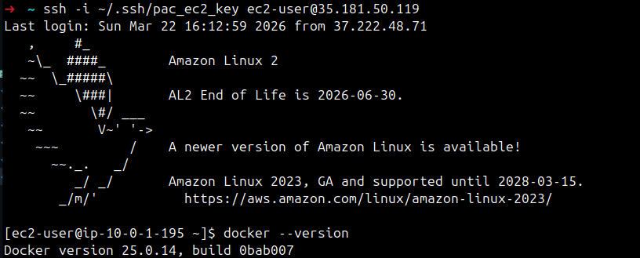

# Ejercicio 6 – Instalar Docker con user_data

## Añadir instalacion de Docker en el arranque

En este ejercicio añado un bloque `user_data` a la instancia EC2 para que Docker se instale automaticamente al iniciar.

Como estoy usando Amazon Linux 2, estos son los comandos que necesito en el script de inicio.

Destacar que añado `user_data_replace_on_change = true` porque en el ejercicio anterior el bloque `user_data` no estaba definido y, al añadirlo ahora, Terraform lo interpreta como un cambio que no se puede aplicar in-place y me obliga a recrear la instancia. Con esta propiedad le indico a Terraform que, si detecta un cambio en el bloque `user_data`, reemplace el recurso para aplicar el nuevo script de inicio.

```hcl
resource "aws_instance" "web_instance" {
  ami                           = data.aws_ami.amazon_linux_2.id
  instance_type                 = "t3.micro"
  subnet_id                     = aws_subnet.public_subnet.id
  vpc_security_group_ids        = [aws_security_group.web_sg.id]
  key_name                      = aws_key_pair.pac_key.key_name
  user_data_replace_on_change   = true

  user_data = <<-EOF
              #!/bin/bash
              yum update -y
              amazon-linux-extras install docker -y
              systemctl enable docker
              systemctl start docker
              usermod -aG docker ec2-user
              EOF

  tags = {
    Name = "pac-web-instance"
  }
}
```

## Aplicar cambios

Primero reviso el plan:

```bash
terraform plan
```

Output recibido:

```
# aws_instance.web_instance must be replaced
-/+ resource "aws_instance" "web_instance" {
      ~ arn                                  = "arn:aws:ec2:eu-west-3:875911184041:instance/i-09a1ba181e0e80578" -> (known after apply)
      ~ associate_public_ip_address          = true -> (known after apply)
      ~ availability_zone                    = "eu-west-3c" -> (known after apply)
      ~ disable_api_stop                     = false -> (known after apply)
      ~ disable_api_termination              = false -> (known after apply)
      ~ ebs_optimized                        = false -> (known after apply)
      + enable_primary_ipv6                  = (known after apply)
      - hibernation                          = false -> null
      + host_id                              = (known after apply)
      + host_resource_group_arn              = (known after apply)
      + iam_instance_profile                 = (known after apply)
      ~ id                                   = "i-09a1ba181e0e80578" -> (known after apply)
      ~ instance_initiated_shutdown_behavior = "stop" -> (known after apply)
      + instance_lifecycle                   = (known after apply)
      ~ instance_state                       = "running" -> (known after apply)
      ~ ipv6_address_count                   = 0 -> (known after apply)
      ~ ipv6_addresses                       = [] -> (known after apply)
      ~ monitoring                           = false -> (known after apply)
      + outpost_arn                          = (known after apply)
      + password_data                        = (known after apply)
      + placement_group                      = (known after apply)
      + placement_group_id                   = (known after apply)
      ~ placement_partition_number           = 0 -> (known after apply)
      ~ primary_network_interface_id         = "eni-01ab8aedcb43f015a" -> (known after apply)
      ~ private_dns                          = "ip-10-0-1-88.eu-west-3.compute.internal" -> (known after apply)
      ~ private_ip                           = "10.0.1.88" -> (known after apply)
      ~ public_dns                           = "ec2-35-180-230-54.eu-west-3.compute.amazonaws.com" -> (known after apply)
      ~ public_ip                            = "35.180.230.54" -> (known after apply)
      ~ secondary_private_ips                = [] -> (known after apply)
      ~ security_groups                      = [] -> (known after apply)
      + spot_instance_request_id             = (known after apply)
        tags                                 = {
            "Name" = "pac-web-instance"
        }
      ~ tenancy                              = "default" -> (known after apply)
      + user_data                            = <<-EOT # forces replacement
            #!/bin/bash
            yum update -y
            amazon-linux-extras install docker -y
            systemctl enable docker
            systemctl start docker
            usermod -aG docker ec2-user
        EOT
      + user_data_base64                     = (known after apply)
      ~ user_data_replace_on_change          = false -> true
        # (10 unchanged attributes hidden)

      ~ capacity_reservation_specification (known after apply)
      - capacity_reservation_specification {
          - capacity_reservation_preference = "open" -> null
        }

      ~ cpu_options (known after apply)
      - cpu_options {
          - core_count            = 1 -> null
          - threads_per_core      = 2 -> null
            # (2 unchanged attributes hidden)
        }

      - credit_specification {
          - cpu_credits = "unlimited" -> null
        }

      ~ ebs_block_device (known after apply)

      ~ enclave_options (known after apply)
      - enclave_options {
          - enabled = false -> null
        }

      ~ ephemeral_block_device (known after apply)

      ~ instance_market_options (known after apply)

      ~ maintenance_options (known after apply)
      - maintenance_options {
          - auto_recovery = "default" -> null
        }

      ~ metadata_options (known after apply)
      - metadata_options {
          - http_endpoint               = "enabled" -> null
          - http_protocol_ipv6          = "disabled" -> null
          - http_put_response_hop_limit = 1 -> null
          - http_tokens                 = "optional" -> null
          - instance_metadata_tags      = "disabled" -> null
        }

      ~ network_interface (known after apply)

      ~ primary_network_interface (known after apply)
      - primary_network_interface {
          - delete_on_termination = true -> null
          - network_interface_id  = "eni-01ab8aedcb43f015a" -> null
        }

      ~ private_dns_name_options (known after apply)
      - private_dns_name_options {
          - enable_resource_name_dns_a_record    = false -> null
          - enable_resource_name_dns_aaaa_record = false -> null
          - hostname_type                        = "ip-name" -> null
        }

      ~ root_block_device (known after apply)
      - root_block_device {
          - delete_on_termination = true -> null
          - device_name           = "/dev/xvda" -> null
          - encrypted             = false -> null
          - iops                  = 100 -> null
          - tags                  = {} -> null
          - tags_all              = {} -> null
          - throughput            = 0 -> null
          - volume_id             = "vol-0fa16112e0c9c77db" -> null
          - volume_size           = 8 -> null
          - volume_type           = "gp2" -> null
            # (1 unchanged attribute hidden)
        }

      ~ secondary_network_interface (known after apply)
    }

Plan: 1 to add, 0 to change, 1 to destroy.

Changes to Outputs:
  ~ web_instance_public_ip = "35.180.230.54" -> (known after apply)
```

Si todo esta correcto, aplico:

```bash
terraform apply
```

Output recibido:

```
aws_instance.web_instance: Destroying... [id=i-09a1ba181e0e80578]
aws_instance.web_instance: Still destroying... [id=i-09a1ba181e0e80578, 00m10s elapsed]
aws_instance.web_instance: Still destroying... [id=i-09a1ba181e0e80578, 00m20s elapsed]
aws_instance.web_instance: Still destroying... [id=i-09a1ba181e0e80578, 00m30s elapsed]
aws_instance.web_instance: Still destroying... [id=i-09a1ba181e0e80578, 00m40s elapsed]
aws_instance.web_instance: Still destroying... [id=i-09a1ba181e0e80578, 00m50s elapsed]
aws_instance.web_instance: Still destroying... [id=i-09a1ba181e0e80578, 01m00s elapsed]
aws_instance.web_instance: Destruction complete after 1m2s
aws_instance.web_instance: Creating...
aws_instance.web_instance: Still creating... [00m10s elapsed]
aws_instance.web_instance: Creation complete after 14s [id=i-05ff84a96c2aeaf8a]

Apply complete! Resources: 1 added, 0 changed, 1 destroyed.

Outputs:

web_instance_public_ip = "35.181.50.119"
```

## Verificar Docker en la instancia

Me conecto por SSH:

```bash
ssh -i ~/.ssh/pac_ec2_key ec2-user@35.181.50.119
```

Y verifico que Docker esta instalado:

```bash
docker --version
```

