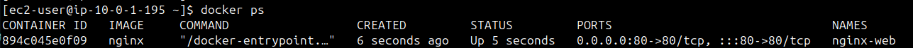
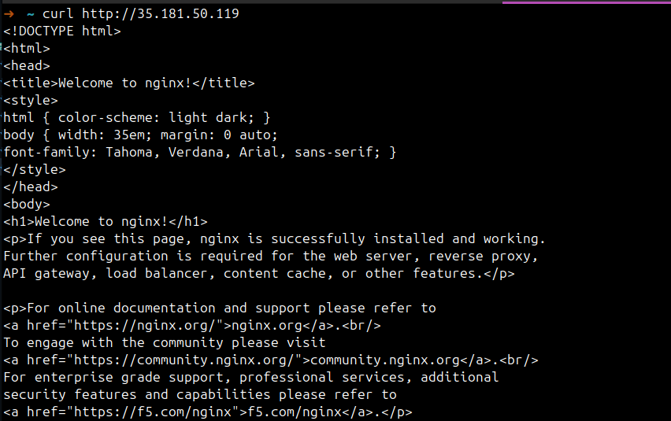
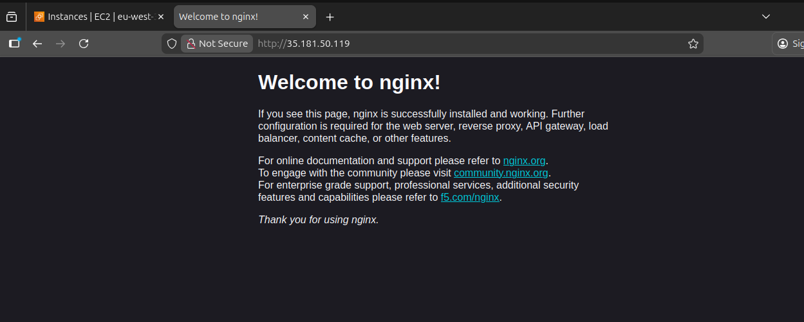

# Ejercicio 7 – Desplegar NGINX en Docker

## Output de IP publica

Este punto ya lo tenia hecho en el ejercicio anterior, asi que no tuve que anadir nada nuevo en Terraform para sacar la IP de la instancia.

## Conexion por SSH a la instancia

Primero me conecto por SSH con la clave privada:

```bash
ssh -i ~/.ssh/pac_ec2_key ec2-user@35.181.50.119
```

`35.181.50.119` la sustituyo por el valor del output `web_instance_public_ip`.

## Desplegar contenedor NGINX en el puerto 80

Una vez dentro de la instancia, arranco un contenedor de NGINX exponiendo el puerto 80 del contenedor al puerto 80 de la instancia (-p 80:80), permitiendo que las peticiones HTTP externas lleguen al servicio NGINX.

```bash
docker run -d --name nginx-web -p 80:80 nginx
```

Con este comando, cualquier peticion HTTP a la IP publica de la instancia responde con la pagina por defecto de NGINX.

## Verificacion

Verifico que el contenedor esta levantado:

```bash
docker ps
```



Desde mi maquina compruebo que responde por HTTP:

```bash
curl http://35.181.50.119
```



Tambien puedo abrir en navegador:

```text
http://35.181.50.119
```

