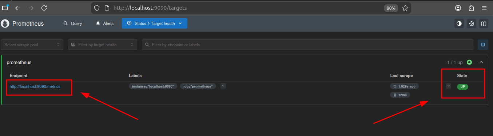
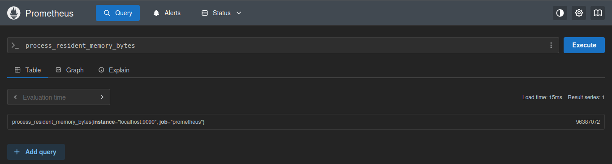
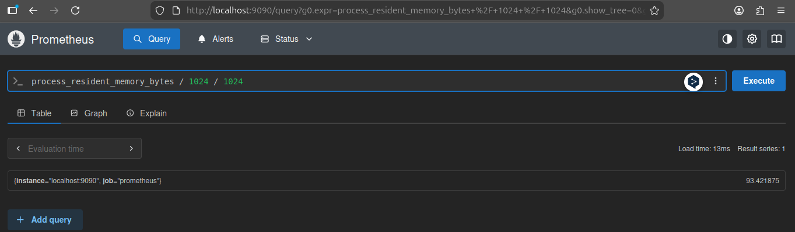
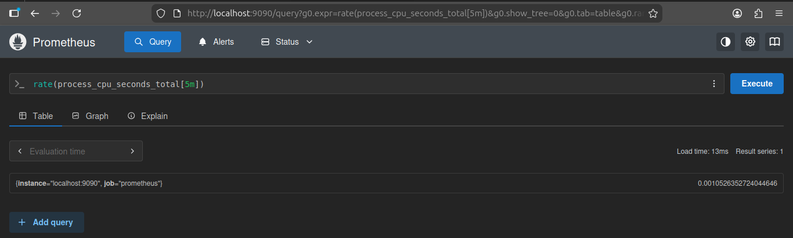

# Ejercicio 1: Prometheus en Docker

### 1. Crear la configuración de Prometheus

Primero, creo un archivo de configuración llamado `prometheus.yml` con el siguiente contenido:

```yaml
global:
  scrape_interval: 15s

scrape_configs:
  - job_name: 'prometheus'

    static_configs:
      - targets: ['localhost:9090']
```

### 2. Ejecutar Prometheus en Docker

Ejecuto el siguiente comando para crear un contenedor de Prometheus utilizando la configuración que acabo de crear:

```bash
docker run -d \
  --name prometheus \
  -p 9090:9090 \
  -v $(pwd)/prometheus.yml:/etc/prometheus/prometheus.yml \
  prom/prometheus
```

### 3. Acceder a la interfaz web

Abro el navegador y consulto la interfaz web de Prometheus en la siguiente URL para verificar que el target está siendo monitoreado:

```
http://localhost:9090/targets
```



## Queries de ejemplo

### Query 1: Memoria utilizada

En la interfaz web de Prometheus ejecuto la siguiente query:

```promql
process_resident_memory_bytes
```

Esta query muestra la memoria residente (en bytes) utilizada por Prometheus.



**Alternativa más legible (en MB):**

```promql
process_resident_memory_bytes / 1024 / 1024
```



### Query 2: CPU utilizada

Ejecuta la siguiente query:

```promql
rate(process_cpu_seconds_total[5m])
```

Esta query muestra la tasa de tiempo de CPU utilizado por Prometheus en los últimos 5 minutos.

