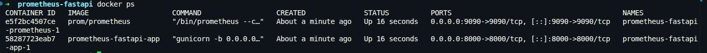
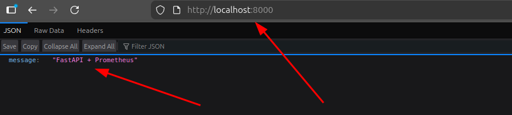
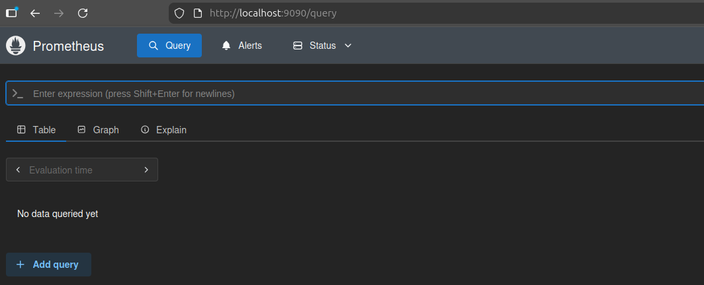
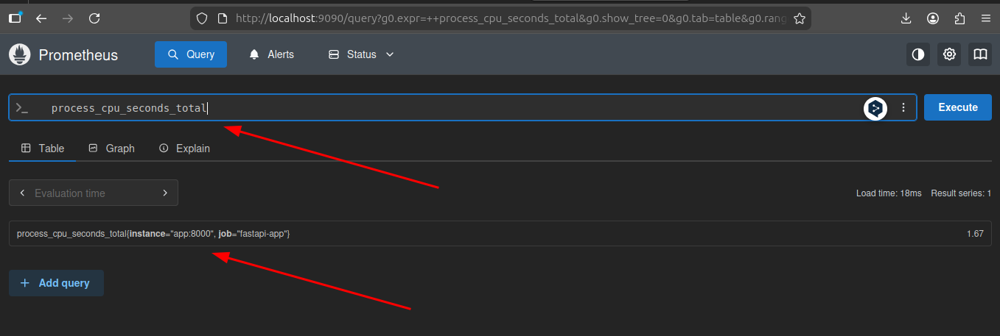
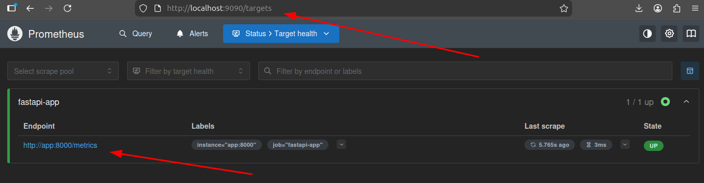

# Ejercicio 5: Setup de Prometheus con FastAPI y Docker Compose
En este ejercicio se configurará una aplicación FastAPI para exponer métricas a Prometheus utilizando Docker Compose.

## Estructura del proyecto

Se crea la siguiente estructura:

```txt
prometheus-fastapi/
│
├── docker-compose.yaml
├── prometheus.yml
│
└── app/
    ├── Dockerfile
    ├── requirements.txt
    └── myapp.py
```

## Explicación de cada archivo

| Archivo             | Función                                 |
| ------------------- | --------------------------------------- |
| docker-compose.yaml | Orquesta todos los servicios Docker     |
| prometheus.yml      | Configuración de scraping de Prometheus |
| myapp.py            | Aplicación FastAPI                      |
| requirements.txt    | Dependencias Python                     |
| Dockerfile          | Construcción de la imagen Docker        |

## Creación de la aplicación FastAPI

Archivo:

```txt
app/myapp.py
```

Contenido:

```python
from fastapi import FastAPI
from prometheus_client import make_asgi_app

app = FastAPI(debug=False)

metrics_app = make_asgi_app()
app.mount("/metrics", metrics_app)

@app.get("/")
def root():
    return {"message": "FastAPI + Prometheus"}
```

## Explicación del código

### FastAPI

```python
app = FastAPI(debug=False)
```

Crea la aplicación web FastAPI.

### Prometheus Client

```python
from prometheus_client import make_asgi_app
```

Importa la librería cliente de Prometheus para Python.

Esta librería expone automáticamente métricas del proceso Python.

### Endpoint /metrics

```python
metrics_app = make_asgi_app()
app.mount("/metrics", metrics_app)
```

Crea el endpoint:

```txt
/metrics
```

Este endpoint será consultado por Prometheus para realizar scraping.

### Endpoint principal

```python
@app.get("/")
```

Endpoint HTTP básico para comprobar que la aplicación funciona correctamente.

## Dependencias Python

Archivo:

```txt
app/requirements.txt
```

Contenido:

```txt
fastapi
uvicorn
prometheus-client
gunicorn
```

### Explicación de dependencias

| Dependencia       | Función                     |
| ----------------- | --------------------------- |
| fastapi           | Framework web ASGI          |
| uvicorn           | Servidor ASGI               |
| prometheus-client | Librería cliente Prometheus |
| gunicorn          | Servidor productivo Python  |

## Dockerfile

Archivo:

```txt
app/Dockerfile
```

Contenido:

```dockerfile
FROM python:3.12-slim

WORKDIR /app

COPY requirements.txt .

RUN pip install --no-cache-dir -r requirements.txt

COPY . .

CMD ["gunicorn", "-b", "0.0.0.0:8000", "myapp:app", "-k", "uvicorn.workers.UvicornWorker"]
```

### Explicación del Dockerfile

#### Imagen base

```dockerfile
FROM python:3.12-slim
```

Utiliza una imagen ligera de Python.

#### Directorio de trabajo

```dockerfile
WORKDIR /app
```

Define el directorio interno del contenedor.

#### Instalación de dependencias

```dockerfile
RUN pip install --no-cache-dir -r requirements.txt
```

Instala todas las librerías necesarias.

#### Gunicorn

```dockerfile
CMD ["gunicorn", ...]
```

Ejecuta la aplicación utilizando Gunicorn.

Se utiliza:

```txt
uvicorn.workers.UvicornWorker
```

para permitir compatibilidad ASGI con FastAPI.

## Configuración de Prometheus

Archivo:

```txt
prometheus.yml
```

Contenido:

```yaml
global:
  scrape_interval: 15s

scrape_configs:
  - job_name: "fastapi-app"
    static_configs:
      - targets: ["app:8000"]
```

### Explicación

#### scrape_interval

```yaml
scrape_interval: 15s
```

Prometheus realizará scraping de métricas cada 15 segundos.

#### job_name

```yaml
job_name: "fastapi-app"
```

Nombre lógico del servicio monitorizado.

#### targets

```yaml
targets: ["app:8000"]
```

Prometheus realizará scraping sobre la aplicación FastAPI.

Dentro de Docker Compose el servicio se llamará:

```txt
app
```

por lo que Prometheus accederá automáticamente al endpoint:

```txt
http://app:8000/metrics
```

## Docker Compose

Archivo:

```txt
docker-compose.yaml
```

Contenido:

```yaml
services:
  app:
    build: ./app
    ports:
      - "8000:8000"

  prometheus:
    image: prom/prometheus
    ports:
      - "9090:9090"
    volumes:
      - ./prometheus.yml:/etc/prometheus/prometheus.yml
    depends_on:
      - app
```

### Explicación

#### Servicio app

```yaml
app:
  build: ./app
```

Construye la aplicación FastAPI utilizando el Dockerfile.

#### Puerto 8000

```yaml
ports:
  - "8000:8000"
```

Permite acceder a la aplicación desde:

```txt
http://localhost:8000
```

#### Servicio Prometheus

```yaml
prometheus:
  image: prom/prometheus
```

Levanta Prometheus utilizando la imagen oficial.

#### Puerto 9090

```yaml
ports:
  - "9090:9090"
```

Permite acceder a Prometheus desde:

```txt
http://localhost:9090
```

#### Volumen

```yaml
volumes:
  - ./prometheus.yml:/etc/prometheus/prometheus.yml
```

Monta la configuración personalizada dentro del contenedor.

#### depends_on

```yaml
depends_on:
  - app
```

Inicia la aplicación FastAPI antes de Prometheus.

## Ejecución del proyecto

Desde la raíz del proyecto se ejecuta:

```bash
docker-compose up --build
```

Esto construirá las imágenes y levantará ambos servicios.

## Verificación

Comprobar que los contenedores están corriendo:

```bash
docker ps
```



Acceder a la aplicación FastAPI:

```txt
http://localhost:8000
```



Acceder a Prometheus:

```txt
http://localhost:9090
```



En Prometheus, realizo una consulta para verificar que se están recibiendo métricas:

```txt
process_cpu_seconds_total
```



Finalmente compruebo que el target es alcanzable:

```txt
http://localhost:9090/targets
```

